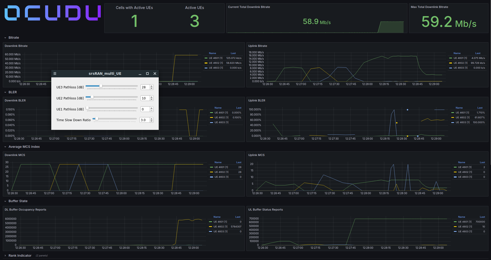

## OCUDU Next Generation Node B

The Next Generation Node B (gNodeB) is a 5G base station configured with OCUDU [\[1\]][ocudu-gnb], connecting User Equipments (UEs) to the 5G Core Network based on the specifications outlined in 3GPP TS 38.300 [\[2\]][ts3191-3gpp], 3GPP TS 38.401 [\[3\]][ts3219-3gpp], and 3GPP TS 38.413 [\[4\]][ts3223-3gpp].

## Usage

- **Compile**: Use `./full_install.sh` to build and install the gNodeB software.
- **Generate Configurations**: Use `./generate_configurations.sh` to create configuration files.
  - The script automatically retrieves the 5G Core Network's AMF address and the SCTP address from the Near-Real-Time RAN Intelligent Controller's E2 Terminator. If either are not found locally, the script will prompt the user to enter the address manually.
  - Configuration files can be accessed and modified in the `configs` directory.
- **Start the gNodeB**: Use `./run.sh` to start the gNodeB, or `./run_background.sh` to run it as a background process where the output is redirected to `logs/gnb_stdout.txt`.
- **Stop the gNodeB**: Terminate the gNodeB with `./stop.sh`.
- **Status**: Check if the gNodeB is running with `./is_running.sh`.
- **Logs**: Access logs by navigating to the `logs` directory.
- **Uninstall**: Use `./uninstall.sh` to remove the gNodeB software.

> [!NOTE]
> If the directory `RAN_Intelligent_Controllers/Near-Real-Time-RIC` is not found, then the `generate_configurations.sh` script will disable the E2 interface. Alternatively, if prompted to enter an E2 address, enter nothing ("") to disable the E2 interface in the gNodeB configuration.

## ZeroMQ Broker

To facilitate multi-UE emulation, the testbed utilizes a ZeroMQ (ZMQ) Broker based on the OCUDU Multi-UE Emulation tutorial [\[5\]][ocudu-multi-ue]. The broker is defined using a GNU Radio Companion flowgraph (`zmq_broker/multi_ue_scenario.grc`) retrieved from the tutorial [\[6\]][ocudu-multi-ue-grc] and compiled into a Python executable using the GNU Radio Companion Compiler (`grcc`). The ZMQ Broker operates the simulated ZeroMQ channel. Its graphical user interface is disabled by default, but can be enabled by setting `SHOW_ZMQ_BROKER_UI=true` in `run.sh`.

> [!NOTE]
> The default `multi_ue_scenario.grc` flowgraph supports three UEs. To change emulated UE scenario, modify the `.grc` file using GNU Radio Companion to add or remove ZeroMQ blocks, delete the existing `zmq_broker/multi_ue_scenario.py`, and run `./generate_configurations.sh` to compile the `.grc` file into a new Python script and automatically patch the required IP addresses.

## O1 Interface

The gNodeB can also be monitored and controlled through the OCUDU O1 Adapter [\[7\]][ocudu-o1-adapter]. Management scripts for the O1 interface are located in the `additional_scripts/` directory. Use `./additional_scripts/install_o1_adapter.sh` to install and build the required components, `./additional_scripts/run_o1_adapter.sh` to start the O1 services, `./additional_scripts/stop_o1_adapter.sh` to stop them, and `./additional_scripts/uninstall_o1_adapter.sh` to remove them.

When running, the O1 setup starts a NETCONF Docker container `ocudu_netconf` and the OCUDU O1 adapter system process. The NETCONF endpoint is exposed at `127.0.0.1:830`.

## OCUDU Grafana WebUI

The gNodeB includes support for visualizing performance metrics via a Grafana dashboard hosted at `http://localhost:3300`.

- **Start Grafana WebUI**: Start the dashboard and its Docker Compose dependencies with `./start_grafana_webui.sh`.
- **Stop Grafana WebUI**: Stop the dashboard container with `./stop_grafana_webui.sh`.

## References

1. OCUDU Ecosystem Foundation. [https://ocudu.org][ocudu-gnb]
2. 3GPP TS 38.300: NR; NR and NG-RAN Overall description; Stage-2 [https://portal.3gpp.org/desktopmodules/Specifications/SpecificationDetails.aspx?specificationId=3191][ts3191-3gpp]
3. 3GPP TS 38.401: NG-RAN; Architecture description. [https://portal.3gpp.org/desktopmodules/Specifications/SpecificationDetails.aspx?specificationId=3219][ts3219-3gpp]
4. 3GPP TS 38.413: NG-RAN; NG Application Protocol (NGAP). [https://portal.3gpp.org/desktopmodules/Specifications/SpecificationDetails.aspx?specificationId=3223][ts3223-3gpp]
5. OCUDU Project Documentation: OCUDU with srsUE [https://ocudu.gitlab.io/ocudu_docs/user_manual/tutorials/srsue/#multi-ue-emulation][ocudu-multi-ue]
6. OCUDU Multi-UE Emulation GRC [https://gitlab.com/ocudu/ocudu_docs/-/blob/main/docs/user_manual/tutorials/srsue/assets/multi_ue_scenario.grc][ocudu-multi-ue-grc]
7. OCUDU O1 Adapter [https://ocudu.gitlab.io/ocudu_docs/oran_apps/ocudu_o1_adapter/][ocudu-o1-adapter]

<!-- References -->

[ocudu-gnb]: https://ocudu.org
[ts3191-3gpp]: https://portal.3gpp.org/desktopmodules/Specifications/SpecificationDetails.aspx?specificationId=3191
[ts3219-3gpp]: https://portal.3gpp.org/desktopmodules/Specifications/SpecificationDetails.aspx?specificationId=3219
[ts3223-3gpp]: https://portal.3gpp.org/desktopmodules/Specifications/SpecificationDetails.aspx?specificationId=3223
[ocudu-multi-ue]: https://ocudu.gitlab.io/ocudu_docs/user_manual/tutorials/srsue/#multi-ue-emulation
[ocudu-multi-ue-grc]: https://gitlab.com/ocudu/ocudu_docs/-/blob/main/docs/user_manual/tutorials/srsue/assets/multi_ue_scenario.grc
[ocudu-o1-adapter]: https://ocudu.gitlab.io/ocudu_docs/oran_apps/ocudu_o1_adapter/
