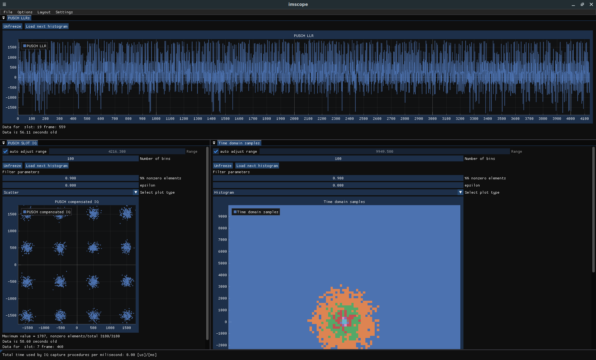

## Next Generation Node B

The Next Generation Node B (gNodeB) is a 5G base station configured with OpenAirInterface [\[1\]][oai-gnb], connecting User Equipments (UEs) to the 5G Core Network based on the specifications outlined in 3GPP TS 38.300 [\[2\]][ts3191-3gpp], 3GPP TS 38.401 [\[3\]][ts3219-3gpp], and 3GPP TS 38.413 [\[4\]][ts3223-3gpp].

## Usage

- **Compile**: Use `./full_install.sh` to build and install the gNodeB software.
- **Generate Configurations**: Use `./generate_configurations.sh` to create configuration files.
  - The script automatically retrieves the 5G Core Network's AMF address. If it is not found locally, the script will prompt the user to enter the address manually.
  - Configuration files can be accessed and modified in the `configs` directory.
- **Start the gNodeB**: Use `./run.sh` to start the gNodeB, or `./run_background.sh` to run it as a background process where the output is redirected to `logs/gnb_stdout.txt`.
- **Stop the gNodeB**: Terminate the gNodeB with `./stop.sh`.
- **Status**: Use `./is_running.sh` to check which gNodeB components are currently running (CU, DU, or gNodeB).
- **Logs**: Access logs by navigating to the `logs` directory.
- **Uninstall**: Use `./uninstall.sh` to remove the gNodeB/UE software.

## Split CU-DU Deployment

The gNodeB can be deployed in a split Central Unit (CU) and Distributed Unit (DU) configuration.
- **Start the CU**: Use `./run_split_cu.sh` or `./run_background_split_cu.sh` to start the CU.
- **Start a DU Instance**: Use `./run_split_du.sh <du_number>` or `./run_background_split_du.sh <du_number>` to start a DU instance, where `du_number` is an integer identifying the DU (e.g., `1` or `2`).
  - In the RF simulator, DU 1 functions as the server by default. For handover scenarios where the UE must serve as the server, start DU 1 with the `--no-rfsim-server` argument to disable its server functionality.
- **Stop the CU/DU/gNodeB**: Use `./stop.sh [selector]` to terminate components. The optional `[selector]` argument specifies which instances to stop: `cu` for all Central Units, `du` for all Distributed Units, a specific DU such as `du1` or `du2`, or `gnb` for all gNodeBs. If no argument is provided, all _nr-softmodem_ components will be stopped.

## Telnet Server for Monitoring and Control

This gNodeB supports an optional telnet server for monitoring and controlling the gNodeB [\[5\]][oai-telnet]. Enable it by setting `TELNET_SERVER=true` at the beginning of the `full_install.sh` script before running it. When starting the gNodeB, if the telnet server was installed, it will automatically start and can be accessed by directly typing into the gNodeB terminal or with `telnet 127.0.0.1 9099`. Use the `help` command within the telnet session to view available commands.

### Telnet Connection to O1 Interface

The gNodeB can also be monitored and controlled remotely using the OpenAirInterface O1 adapter [\[6\]][oai-o1-adapter], which runs as a Docker container. Management scripts for the O1 adapter container are located in the `additional_scripts/` directory. Use `./install_o1_adapter.sh` to configure and build the adapter, `./run_o1_adapter.sh` to start the container which connects to the gNodeB's telnet server, `./stop_o1_adapter.sh` to stop the container, and `./uninstall_o1_adapter.sh` to uninstall it. While running, the endpoint `127.0.0.1:830` can be connected to over NETCONF for Non-RT RIC KPM monitoring and RIC control. Endpoints can be configured by updating the variables set in `install_o1_adapter.sh` (which modifies `o1-adapter/docker/config/config.json`), then re-installing the O1 adapter.

## ImScope

ImScope can be enabled for the gNodeB by setting `NRSCOPE_GUI=true` at the beginning of the `full_install.sh` script before running it. For more information about ImScope, see the OpenAirInterface documentation [\[7\]][oai-imscope].

  
View Screenshot

  

## References

1. OpenAirInterface 5G Wireless Implementation. OpenAirInterface. [https://gitlab.eurecom.fr/oai/openairinterface5g][oai-gnb]
2. 3GPP TS 38.300: NR; NR and NG-RAN Overall description; Stage-2. [https://portal.3gpp.org/desktopmodules/Specifications/SpecificationDetails.aspx?specificationId=3191][ts3191-3gpp]
3. 3GPP TS 38.401: NG-RAN; Architecture description. [https://portal.3gpp.org/desktopmodules/Specifications/SpecificationDetails.aspx?specificationId=3219][ts3219-3gpp]
4. 3GPP TS 38.413: NG-RAN; NG Application Protocol (NGAP). [https://portal.3gpp.org/desktopmodules/Specifications/SpecificationDetails.aspx?specificationId=3223][ts3223-3gpp]
5. Starting the softmodem with the telnet server. OpenAirInterface. [https://gitlab.eurecom.fr/oai/openairinterface5g/-/blob/develop/common/utils/telnetsrv/DOC/telnetusage.md][oai-telnet]
6. OAI O1 Adapter. OpenAirInterface. [https://gitlab.eurecom.fr/oai/o1-adapter][oai-o1-adapter]
7. ImScope. OpenAirInterface. [https://gitlab.eurecom.fr/oai/openairinterface5g/-/blob/develop/openair1/PHY/TOOLS/readme.md?ref_type=heads#imscope][oai-imscope]

<!-- References -->

[oai-gnb]: https://gitlab.eurecom.fr/oai/openairinterface5g
[ts3191-3gpp]: https://portal.3gpp.org/desktopmodules/Specifications/SpecificationDetails.aspx?specificationId=3191
[ts3219-3gpp]: https://portal.3gpp.org/desktopmodules/Specifications/SpecificationDetails.aspx?specificationId=3219
[ts3223-3gpp]: https://portal.3gpp.org/desktopmodules/Specifications/SpecificationDetails.aspx?specificationId=3223
[oai-telnet]: https://gitlab.eurecom.fr/oai/openairinterface5g/-/blob/develop/common/utils/telnetsrv/DOC/telnetusage.md
[oai-o1-adapter]: https://gitlab.eurecom.fr/oai/o1-adapter
[oai-imscope]: https://gitlab.eurecom.fr/oai/openairinterface5g/-/blob/develop/openair1/PHY/TOOLS/readme.md?ref_type=heads#imscope