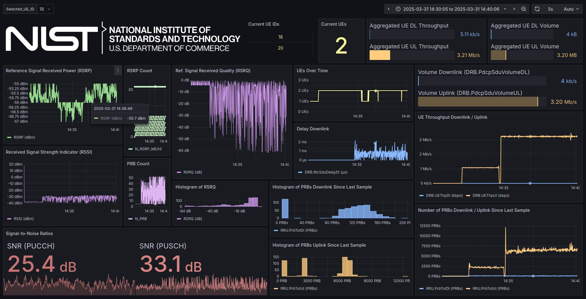

## Flexible RAN Intelligent Controller (FlexRIC)

The Near-RT RIC, conceptualized by the O-RAN Alliance's Working Group 3 (WG3) [\[1\]][oran-wg3] and implemented by EURECOM [\[2][mosaic5g-flexric], [3\]][eurecom-nearrtric], enables dynamic management and optimization of Radio Access Networks (RAN).

## Usage

- **Compile**: Use `./full_install.sh` to build and install the Near-RT RIC software.
- **Generate Configurations**: Use `./generate_configurations.sh` to create configuration files.
  - Configuration files can be accessed and modified in the `configs` directory.
- **Start the Near-RT RIC**: Use `./run.sh` to start the Near-RT RIC application.
- **Stop the Near-RT RIC**: Terminate the Near-RT RIC with `./stop.sh`.
- **Status**: Check if the Near-RT RIC is running with `./is_running.sh`.
- **Logs**: Access logs by navigating to the `logs` directory.
- **Uninstall**: Use `./uninstall.sh` to remove the Near-RT RIC software.

## Running an xApp

This installation of the Near-RT RIC supports six xApps.

- **KPM Monitor xApp (xapp_kpm_moni, revised xApp)**:
  - Run with `./run_xapp_kpm_moni.sh`.
  - Sets `XAPP_DURATION=-1` to run indefinitely and include new metrics (see below).
    - Pre-existing metrics from OpenAirInterface:
      ```console
      DRB.PdcpSduVolumeDL (kb) - Downlink volume of the UE since the last sample
      DRB.PdcpSduVolumeUL (kb) - Uplink volume of the UE since the last sample
      DRB.RlcSduDelayDl (μs) - Delay downlink, (100ms-windowed) per-packet sojourn (SDU to PDU) in microseconds
      DRB.UEThpDl (kbps) - Downlink throughput of the UE since the last sample
      DRB.UEThpUl (kbps) - Uplink throughput of the UE since the last sample
      RRU.PrbTotDl (PRB count) - Number of resource blocks received since the last sample
      RRU.PrbTotUl (PRB count) - Number of resource blocks sent since the last sample
      ```
    - New metrics for the automation tool:
      ```console
      Reporting Time Offset (ms) - Time offset from the expected reporting time in milliseconds (e.g., -1 indicates that the report arrived a millisecond early)
      RSRP.Mean (dBm) - Averaged SSB/CSI-RS Reference Signal Received Power in the sample
      RSRP.Count (count) - Number of RSRP measurements in the sample, used to calculate RSRP
      ```
    - Note that this xApp uses REPORT Style 4 (O-RAN E2SM-KPM clause 7.4.5) with the condition being to match the UE's Slice/Service Type (SST) and Slice Differentiator (SD). The code has been patched to subscribe to 4-octet slice IDs (SST+SD) if SD ≠ 0xFFFFFF, instead of a 1-octet SST (clause 8.3.11).
- **KPM Monitor to CSV xApp (xapp_kpm_moni_write_to_csv, new xApp)**:
  - Retains all functionality from xapp_kpm_moni, but rather than outputting to stdout, writes to `logs/KPI_Metrics.csv`.
- **KPM Monitor to InfluxDB v2 xApp (xapp_kpm_moni_write_to_influxdb, new xApp)**:
  - Retains all functionality from xapp_kpm_moni, but rather than outputting to stdout, writes to a InfluxDB database (/var/lib/influxdb).
- **MAC + RLC + PDCP + GTP Monitor xApp (xapp_gtp_mac_rlc_pdcp_moni)**:
  - Run with `./additional_scripts/run_xapp_gtp_mac_rlc_pdcp_moni.sh`.
- **RIC Control xApp (xapp_kpm_rc)**:
  - Run with `./additional_scripts/run_xapp_kpm_rc.sh`.
- **RIC Control Monitor xApp (xapp_rc_moni)**:
  - Run with `./additional_scripts/run_xapp_rc_moni.sh`.

## KPM Monitor Visualization in Grafana

After the KPM Monitor xApp subscribes to the E2 node, metrics of the gNodeB and UE are sent through the E2 interface and received by the xApp. An xApp has been made at `flexric/build/examples/xApp/c/monitor/xapp_kpm_moni_write_to_csv` which writes the metrics to logs/KPI_Metrics.csv instead of printing them to the console. The Python server at `additional_scripts/python_server_for_grafana.py` will make this CSV file accessible at `http://localhost:3030/KPI_Metrics.csv`, and a Grafana [\[4\]][grafanalabs-grafana] dashboard has been created to consume this data and visualize it.

- **Real-Time Metrics**: To start the xApp that generates `logs/KPI_Monitor.csv`, the Python server that hosts the file, and the Grafana server, run the following.
  ```console
  ./additional_scripts/start_grafana_with_xapp_kpm_moni.sh
  ```

- **Non-Real Time Metrics**: Since it is not a requirement for the xApp to actively write metrics to `logs/KPI_Monitor.csv`, the Python server and Grafana server can be started without the xApp by running the following.
  ```console
  ./additional_scripts/start_grafana_only.sh
  ```
  A sample KPI_Metrics.csv file has been provided, and can be applied with `cp additional_scripts/sample_KPI_Metrics.csv logs/KPI_Metrics.csv`.

- **Initial Configuration**: The dashboard uses the Infinity plugin (yesoreyeram-infinity-datasource [\[5\]][grafana-infinity]), which will require creating a data source under Connections → Data sources → Add data source → Infinity. Configure it under URL, Headers & Params → Base URL → Type "`http://localhost:3030/`" → Save & test.

- **Stop Grafana**: To stop the Grafana server, Python server, and xApp, use `./additional_scripts/stop_grafana_and_python_server.sh`.

The Grafana dashboard is accessible at `http://localhost:3000` with default credentials being "admin". Upon initial startup, import the following JSON file into the Grafana client by navigating to Dashboards → New → Import: `additional_scripts/grafana_xapp_dashboard.json`. Please note that the dashboard and the metrics provided with this software are still in development and therefore may display some inaccurate values. Below is a snapshot of the dashboard in its current state.

<p align="center">
  
</p>

## References

1. Working Group 3: Near-Real-time RAN Intelligent Controller and E2 Interface Workgroup. O-RAN Alliance. [https://public.o-ran.org/display/WG3/Introduction][oran-wg3]
2. FlexRIC: an SDK for next-generation SD-RANs. R. Schmidt, M. Irazabal, N. Nikaein. [https://dl.acm.org/doi/10.1145/3485983.3494870][mosaic5g-flexric]
3. Flexible RAN Intelligent Controller (FlexRIC) and E2 Agent. Mosaic5G. [https://gitlab.eurecom.fr/mosaic5g/flexric][eurecom-nearrtric]
4. The open-source platform for monitoring and observability. Grafana Labs. [https://github.com/grafana/grafana][grafanalabs-grafana]
5. Grafana Infinity Datasource. yesoreyeram. [https://github.com/grafana/grafana-infinity-datasource][grafana-infinity]

<!-- References -->

[oran-wg3]: https://public.o-ran.org/display/WG3/Introduction
[mosaic5g-flexric]: https://dl.acm.org/doi/10.1145/3485983.3494870
[eurecom-nearrtric]: https://gitlab.eurecom.fr/mosaic5g/flexric
[grafanalabs-grafana]: https://github.com/grafana/grafana
[grafana-infinity]: https://github.com/grafana/grafana-infinity-datasource
