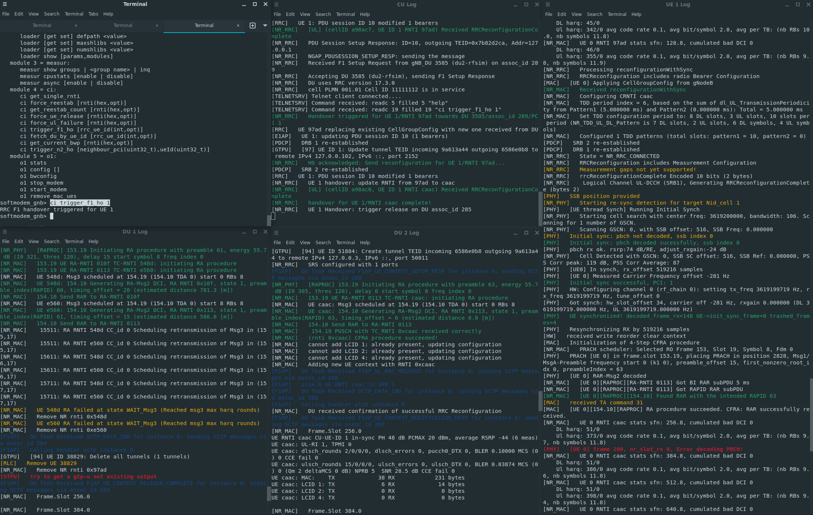

## OpenAirInterface Testbed

This testbed deployment consists of a 5G Core Network by Open5GS [\[1\]][open5gs-core], gNodeB and 5G UE by OpenAirInterface at Eurecom [\[2\]][oai-ue-gnb], and FlexRIC by Mosaic5G at Eurecom [\[3\]][mosaic-flexric]. The scripts in these directories build, install, and configure the testbed components similar to the parent directory. Each directory contains a `README.md` file providing more details on the respective testbed component.

## Usage

- **Installation**: Use `./full_install.sh` to build and install the testbed components, and `./full_uninstall.sh` to remove them.
- **Generate Configurations**: Use `./generate_configurations.sh` to create configuration files for each testbed component.
- **Start the Testbed**: Use `./run.sh` to start the 5G Core, FlexRIC, gNodeB, and UE as background processes, and KPM monitoring xApp in the foreground.
  - To start the testbed components but use a modified KPM monitor xApp that logs the metrics to file and a Grafana dashboard to fetch and visualize the metrics in real-time, use `./run_with_grafana_dashboard.sh`.
- **Run an xApp**: Once the 5G Core, FlexRIC, gNodeB, and UE are running and properly connected, use the `./run_xapp_*` scripts within the RAN_Intelligent_Controllers/FlexRIC/additional_scripts directory to interact with the gNodeB and UE.
- **Send Traffic Through a UE**: Scripts under User_Equipment/additional_scripts provide the ability to open a shell in the UE's network namespace, simulate traffic from UE to the core, or from core to the UE.
- **Stop the Testbed**: Terminate the testbed components with `./stop.sh`.
- **Status**: Check which testbed components are running with `./is_running.sh`.
- **Debugging Information**: Configuration files are in the `configs/` directory, and log files are located in the `logs/` directory for each component.

## Potential Cause for Build Errors
It may be required for the AVX2 instruction set to be available on the host machine installing the OpenAirInterface testbed.

  
<b>Enabling VT-x/AMD-V for the AVX2 instruction set</b>

  

  When running a VM to build OpenAirInterface5G, compilation errors may occur if not using VT-x/AMD-V due to an unsupported AVX2 instruction set. In VirtualBox, the lower right corner will show a "V" icon if using VT-x/AMD-V, otherwise, it will show a turtle icon. Additionally, AVX2 support can be verified by checking that `cat /proc/cpuinfo | grep avx2` is not empty. The following steps can be taken to ensure that VT-x/AMD-V is enabled in a VirtualBox VM.
  
  - **CPU Virtualization Support**: Look up if the CPU model supports virtualization and ensure that it is enabled in the BIOS.
  - **Disable Hyper-V**: Hyper-V may prevent VT-x/AMD-V from being enabled. If using Windows, the following options should be unchecked in the "Turn Windows features on or off" settings: "Hyper-V", "Windows Hypervisor Platform", and "Virtual Machine Platform". If a change is made, a reboot is required.
  - **VirtualBox**: From the VirtualBox Manager, select the VM and click the "Information" tab. Look for "Acceleration: VT-x/AMD-V".
    - If the VM shows this but the AVX2 instruction set is still disabled, then disabling core isolation is a potential reason. Please exercise extreme caution as it is not advised to disable core isolation. However, it can be disabled in the "Windows Security" settings by unchecking "Memory Integrity" and rebooting.
  - If `cat /proc/cpuinfo | grep avx2` is not empty, then OpenAirInterface should be able to build without issues.

## Handover Scenario

The script `run_handover_scenario.sh`, based on the handover tutorial [\[4\]][oai-handover], automates the process of setting up a handover scenario with two DUs and one CU. It starts the 5G Core, FlexRIC, CU, DU 1, and UE 1. After UE connectivity, it starts DU 2 and opens a telnet session to the CU for monitoring and controlling the handover process.
  - The variable `TELNET_SERVER` in `Next_Generation_Node_B/full_install.sh` must be set to `true` prior to gNodeB installation.
  - To start each component in its own gnome-terminal instance, use `./run_handover_scenario.sh show`.
  - The command `ci trigger_f1_ho 1` will trigger a handover for UE 1 from its current DU to the next DU in a round robin manner.

  
<b>Example of F1 handover output</b>

  

  
  

    
  

---

## References

1. Open Source implementation for 5G Core and EPC. Open5GS. [https://github.com/open5gs/open5gs][open5gs-core]
2. Openairinterface 5G Wireless Implementation. OpenAirInterface. [https://gitlab.eurecom.fr/oai/openairinterface5g][oai-ue-gnb]
3. Flexible RAN Intelligent Controller (FlexRIC) and E2 Agent. Mosaic5G. [https://gitlab.eurecom.fr/mosaic5g/flexric][mosaic-flexric]
4. OpenAirInterface Handover Tutorial. OpenAirInterface. [https://gitlab.eurecom.fr/oai/openairinterface5g/-/blob/develop/doc/handover-tutorial.md][oai-handover]

<!-- References -->

[open5gs-core]: https://github.com/open5gs/open5gs
[oai-ue-gnb]: https://gitlab.eurecom.fr/oai/openairinterface5g
[mosaic-flexric]: https://gitlab.eurecom.fr/mosaic5g/flexric
[oai-handover]: https://gitlab.eurecom.fr/oai/openairinterface5g/-/blob/develop/doc/handover-tutorial.md