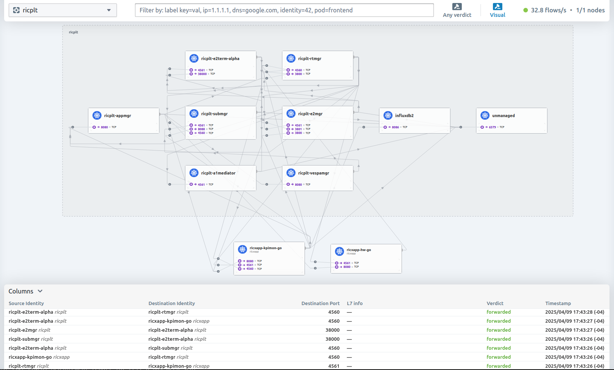

## Near-RT RIC, K-Release

The Near-RT RIC, conceptualized by the O-RAN Alliance's Working Group 3 (WG3) [[1]][oran-wg3] and implemented by the O-RAN Software Community [[2]][oransc-nearrtric], enables dynamic management and optimization of Radio Access Networks (RAN).

This automation tool is based on the K-Release of the Near-RT RIC. More information about these releases can be found at [[3]][oransc-releases].

## Usage

- **Installation Process**: Use `./full_install.sh` to get the Near-RT RIC running on the host machine. The installation process consists of the following steps.
  - Installs Docker, Kubernetes, and Helm if not previously installed.
  - Uses Helm to install the RIC components.
  - Builds, installs, and configures the E2 Simulator (e2sim).
  - Connects the e2term pod to e2sim within the Near-RT RIC.
  - Installs and Configures the xApp manager (appmgr) to deploy a Hello World (hw-go) xApp.

- **Start the Near-RT RIC**: While the Kubernetes pods start automatically on system boot, the entire process of ensuring that the components are running, connected, and that the xApp is deployed can be re-executed with `./run.sh`.
- **Status**: Check on a pod's status with `kubectl get pods -A`, or by running the interactive pod manager (K9s) with `k9s -A` or `./start_k9s.sh`.
- **Logs**: From within K9s, use the `Arrow Keys` to highlight a pod, `Enter` to view the logs for the pod, `w` to wrap text, `Esc` to go back, `Ctrl+k` to restart a pod that isn't responding, and `s` to open a command line shell in the pod.
- **Uninstall**: Remove the Near-RT RIC with `./full_uninstall.sh`.

<details>
  <summary><b>View the list of Kubernetes pods running after the Near-RT RIC is installed.</b></summary>
  <hr>
  
```console
$ kubectl get pods -A
NAMESPACE      NAME                                                        READY   STATUS
kube-flannel   kube-flannel-ds-rfsxv                                       1/1     Running
kube-system    coredns-668d6bf9bc-hzjjt                                    1/1     Running
kube-system    coredns-668d6bf9bc-pql2s                                    1/1     Running
kube-system    etcd-vmware-022                                             1/1     Running
kube-system    kube-apiserver-vmware-022                                   1/1     Running
kube-system    kube-controller-manager-vmware-022                          1/1     Running
kube-system    kube-proxy-7c6hq                                            1/1     Running
kube-system    kube-scheduler-vmware-022                                   1/1     Running
ricinfra       deployment-tiller-ricxapp-84b87b8c64-tjvkx                  1/1     Running
ricplt         deployment-ricplt-a1mediator-78f79cbb6b-rchrz               1/1     Running
ricplt         deployment-ricplt-alarmmanager-5b49476676-sfdfn             1/1     Running
ricplt         deployment-ricplt-appmgr-5564b65869-zq5qt                   1/1     Running
ricplt         deployment-ricplt-e2mgr-9b6b8f99f-g98jt                     1/1     Running
ricplt         deployment-ricplt-e2term-alpha-f8f7d7855-zwdkp              1/1     Running
ricplt         deployment-ricplt-o1mediator-bf4fb5758-5dp78                1/1     Running
ricplt         deployment-ricplt-rtmgr-657457c4bb-5kk4j                    1/1     Running
ricplt         deployment-ricplt-submgr-858956fbdc-zbbp8                   1/1     Running
ricplt         deployment-ricplt-vespamgr-848f7bb874-l4kzc                 1/1     Running
ricplt         r4-infrastructure-kong-79d7985749-tfsb2                     2/2     Running
ricplt         r4-infrastructure-prometheus-alertmanager-b9cc56766-gqmt2   2/2     Running
ricplt         r4-infrastructure-prometheus-server-6476958975-mtkz9        1/1     Running
ricplt         statefulset-ricplt-dbaas-server-0                           1/1     Running
ricxapp        ricxapp-hw-go-c84579888-rtjn9                               1/1     Running
```
  </pre>

   _Note: Upon installing an xApp requiring InfluxDB, the pod "r4-influxdb-influxdb2-0" will also be installed._

</details>

---

## Installing an xApp

By default, the Hello World Go xApp (hw-go) is installed automatically. Additional xApps can be installed to extend the functionality of the Near-RT RIC. For convenience, installation scripts for the following xApps are included:

- **KPI Monitoring xApp (kpimon)**:
  - Install with `./additional_scripts/install_xapp_kpi_monitor.sh`.
  - Patched to connect to the InfluxDB pod and write metrics to its database.
    - Upon initialization, the xApp will only connect to pre-existing E2 nodes, therefore, you can restart the xApp by running the install script again which will establish connections to any new E2 nodes.
    - Metrics will be stored in the InfluxDB pod under `bucket=kpimon, org=influxdata`. Access this data by opening the InfluxDB Client with `./additional_scripts/open_influxdb_client_shell.sh`.
  - Information about the xApp's debugging and usage can be found at [[6]][abdul-kpimon-go].
  - More information can be found in the documentation [[4]][kpimon-go-docs] and code [[5]][kpimon-go-code].
- **5G Cell Anomaly Detection xApp (ad-cell)**:
  - Install with `./additional_scripts/install_xapp_5g_cell_anomaly_detection.sh`.
  - As a prerequisite, the database must contain a sufficient amount of measurements.
  - More information can be found in the documentation [[7]][ad-cell-docs] and code [[8]][ad-cell-code].
- **Anomaly Detection xApp (ad)**:
  - Install with `./additional_scripts/install_xapp_anomaly_detection.sh`.
  - Patched to support InfluxDB version 2._X_ instead of InfluxDB 1._X_.
  - As a prerequisite, the database must contain a sufficient amount of measurements.
  - More information can be found in the documentation [[9]][ad-docs] and code [[10]][ad-code].
- **Quality of Experience Predictor xApp (qp)**:
  - Install with `./additional_scripts/install_xapp_qoe_predictor.sh`.
  - Patched to support InfluxDB version 2._X_ instead of InfluxDB 1._X_.
  - As a prerequisite, the database must contain a sufficient amount of measurements.
  - More information can be found in the documentation [[11]][qp-docs] and code [[12]][qp-code].
- **RIC Control xApp (rc)**:
  - Install with `./additional_scripts/install_xapp_ric_control.sh`.
  - More information can be found in the documentation [[13]][rc-docs] and code [[14]][rc-code].
- **Traffic Steering xApp (trafficxapp)**:
  - Install with `./additional_scripts/install_xapp_traffic_steering.sh`.
  - More information can be found in the documentation [[15]][trafficxapp-docs] and code [[16]][trafficxapp-code].
- **Hello World Python xApp (hw-python)**:
  - Install with `./additional_scripts/install_xapp_hw-python.sh`.
  - More information can be found in the code [[17]][hw-python-code].
- **Hello World Rust xApp (hw-rust)**:
  - Install with `./additional_scripts/install_xapp_hw-rust.sh`.
  - More information can be found in the code [[18]][hw-rust-code].
 
> [!NOTE]
> The metrics collected using these xApps are simulated by default. Similarly, radio metrics provided by srsRAN_Project's gNodeB when connected as an E2 node to the RIC may also be simulated [[19]][srsran-lim]. Therefore, for radio metrics collected via a KPI monitoring xApp, it is recommended to use OpenAirInterface's Near-RT RIC with Mosiac5G's monitoring xApps (see the [OpenAirInterface Testbed](../../OpenAirInterface_Testbed)).

## Uninstalling an xApp

To uninstall an xApp, run `./additional_scripts/uninstall_an_xapp.sh` which will prompt the user to select an xApp to uninstall.
Alternatively, xApps can be uninstalled manually by fetching the list of xApps with `dms_cli get_charts_list` and uninstalling an xApp with `dms_cli uninstall "NAME_OF_XAPP" ricxapp`.

## Migration to Cilium

The cluster is installed with Flannel as the default network plugin. There are several benefits of migrating to a security-enhanced network plugin like Cilium [[20]][cilium-io], for example, to monitor and regulate the network flows going in to and out of each pod using Cilium Hubble [[21]][cilium-hubble]. By default, pods can communicate with addresses outside the namespace (including the internet). Restricting this allows for better security and monitoring of the network flows. The following steps can be used to migrate the cluster to Cilium and apply policies that restrict such communications.

- **Install Cilium and Migrate Cluster Nodes**: Run `./additional_scripts/install_cilium_and_migrate_nodes.sh` to install Cilium and migrate each of the pods from the current network plugin to Cilium, then apply policies that restrict the pods from communicating with addresses outside the namespace.
  - For debugging purposes, the following files are generated in `$HOME/.kube/`:
    - `cilium-values-migration.yaml`: Contains the Cilium configuration values during migration.
    - `cilium-values-initial.yaml`: Contains the initial Cilium configuration values.
    - `cilium-values-final.yaml`: Contains the final Cilium configuration values.
- **Check Cilium Status**: Run `./additional_scripts/cilium_status.sh` to verify the status of Cilium. All indicators should display green.
- **List Cilium Policies**: Run `./additional_scripts/cilium_list_policies.sh` to list currently-active Cilium policies.
  - By default, the two policies are applied: `isolate-ric-communication` and `isolate-ricxapp-communication`. Both are defined in the YAML file: `$HOME/.kube/cilium-policy.yaml`.
- **Disable Policies**: Run `./additional_scripts/cilium_disable_policies.sh` to disable the currently-active policies. After running the script, pods will have restored internet access.
- **Enable Policies**: Run `./additional_scripts/cilium_enable_policies.sh` to re-enable the policies defined in `$HOME/.kube/cilium-policy.yaml`.
- **Check Policy Enforcement**: Run `./additional_scripts/cilium_check_enforcement.sh` to check which pod labels are enforced by the policies.
- **Visualize and Capture Network Flows**: Hubble can be used to monitor the network flows of the pods.
  - Run `./additional_scripts/hubble_capture.sh` to capture the network flows. The output will be saved to `logs/hubble_captured_flows.csv` with the following columns:
    - Timestamp (readable)
    - UNIX Epoch (seconds)
    - Summary
    - Is Reply
    - Source IP
    - Destination IP
    - Source Port
    - Destination Port
    - Source Pod
    - Destination Pod
    - Source Namespace
    - Destination Namespace
    - Protocol
    - Layer 4
  - Run `./additional_scripts/hubble_visualize.sh` to visualize the network flows using the Hubble UI.

<p align="center">
  
</p>
  
## References

1. Working Group 3: Near-Real-time RAN Intelligent Controller and E2 Interface Workgroup. O-RAN Alliance. [https://public.o-ran.org/display/WG3/Introduction][oran-wg3]
2. Near Realtime RAN Intelligent Controller. O-RAN Software Community. [https://docs.o-ran-sc.org/en/latest/projects.html#near-realtime-ran-intelligent-controller-ric][oransc-nearrtric]
3. Release Notes. O-RAN Software Community. [https://docs.o-ran-sc.org/en/latest/release-notes.html][oransc-releases]
4. KPI Monitoring xApp documentation. O-RAN Software Community. [https://docs.o-ran-sc.org/projects/o-ran-sc-ric-app-kpimon/en/latest/overview.html][kpimon-go-docs]
5. KPI Monitoring xApp project page. O-RAN Software Community. [https://github.com/o-ran-sc/ric-app-kpimon-go][kpimon-go-code]
6. Install KPI Monitoring & xApp RIC. Abdul Fikih Kurnia. [https://hackmd.io/@abdfikih/BkIeoH9D0][abdul-kpimon-go]
7. 5G Cell AD xApp documentation. O-RAN Software Community. [https://docs.o-ran-sc.org/projects/o-ran-sc-ric-app-ad/en/latest/overview.html][ad-cell-docs]
8. 5G Cell AD xApp project page. O-RAN Software Community. [https://github.com/o-ran-sc/ric-app-ad-cell][ad-cell-code]
9. AD xApp documentation. O-RAN Software Community. [https://docs.o-ran-sc.org/projects/o-ran-sc-ric-app-ad/en/latest/overview.html][ad-docs]
10. AD xApp project page. O-RAN Software Community. [https://github.com/o-ran-sc/ric-app-ad][ad-code]
11. QoE Predictor xApp documentation. O-RAN Software Community. [https://docs.o-ran-sc.org/projects/o-ran-sc-ric-app-qp/en/latest/overview.html][qp-docs]
12. QoE Predictor xApp project page. O-RAN Software Community. [https://github.com/o-ran-sc/ric-app-qp][qp-code]
13. RIC Control xApp documentation. O-RAN Software Community. [https://docs.o-ran-sc.org/projects/o-ran-sc-ric-app-rc/en/latest/overview.html][rc-docs]
14. RIC Control xApp project page. O-RAN Software Community. [https://github.com/o-ran-sc/ric-app-rc][rc-code]
15. Traffic Steering xApp documentation. O-RAN Software Community. [https://docs.o-ran-sc.org/projects/o-ran-sc-ric-app-ts/en/latest/user-guide.html][trafficxapp-docs]
16. Traffic Steering xApp project page. O-RAN Software Community. [https://github.com/o-ran-sc/ric-app-ts][trafficxapp-code]
17. HW Python xApp project page. O-RAN Software Community. [https://github.com/o-ran-sc/ric-app-hw-python][hw-python-code]
18. HW Rust xApp project page. O-RAN Software Community. [https://github.com/o-ran-sc/ric-app-hw-rust][hw-rust-code]
19. O-RAN NearRT-RIC and xApp. srsRAN Project Documentation. [https://docs.srsran.com/projects/project/en/latest/tutorials/source/near-rt-ric/source/index.html#limitations]
20. eBPF-based Networking, Observability, Security. Cilium. [https://cilium.io][cilium-io]
21. Hubble - Network, Service & Security Observability for Kubernetes using eBPF. Hubble. [https://cilium.io/hubble][cilium-hubble]

<!-- References -->

[oran-wg3]: https://public.o-ran.org/display/WG3/Introduction
[oransc-nearrtric]: https://docs.o-ran-sc.org/en/latest/projects.html#near-realtime-ran-intelligent-controller-ric
[oransc-releases]: https://docs.o-ran-sc.org/en/latest/release-notes.html
[kpimon-go-code]: https://github.com/o-ran-sc/ric-app-kpimon-go
[kpimon-go-docs]: https://docs.o-ran-sc.org/projects/o-ran-sc-ric-app-kpimon/en/latest/overview.html
[abdul-kpimon-go]: https://hackmd.io/@abdfikih/BkIeoH9D0
[ad-cell-code]: https://github.com/o-ran-sc/ric-app-ad-cell
[ad-cell-docs]: https://docs.o-ran-sc.org/projects/o-ran-sc-ric-app-ad/en/latest/overview.html
[ad-code]: https://github.com/o-ran-sc/ric-app-ad
[ad-docs]: https://docs.o-ran-sc.org/projects/o-ran-sc-ric-app-ad/en/latest/overview.html
[qp-code]: https://github.com/o-ran-sc/ric-app-qp
[qp-docs]: https://docs.o-ran-sc.org/projects/o-ran-sc-ric-app-qp/en/latest/overview.html
[rc-code]: https://github.com/o-ran-sc/ric-app-rc
[rc-docs]: https://docs.o-ran-sc.org/projects/o-ran-sc-ric-app-rc/en/latest/overview.html
[trafficxapp-code]: https://github.com/o-ran-sc/ric-app-ts
[trafficxapp-docs]: https://docs.o-ran-sc.org/projects/o-ran-sc-ric-app-ts/en/latest/user-guide.html
[hw-python-code]: https://github.com/o-ran-sc/ric-app-hw-python
[hw-rust-code]: https://github.com/o-ran-sc/ric-app-hw-rust
[srsran-lim]: https://docs.srsran.com/projects/project/en/latest/tutorials/source/near-rt-ric/source/index.html#limitations
[cilium-io]: https://cilium.io
[cilium-hubble]: https://cilium.io/hubble
