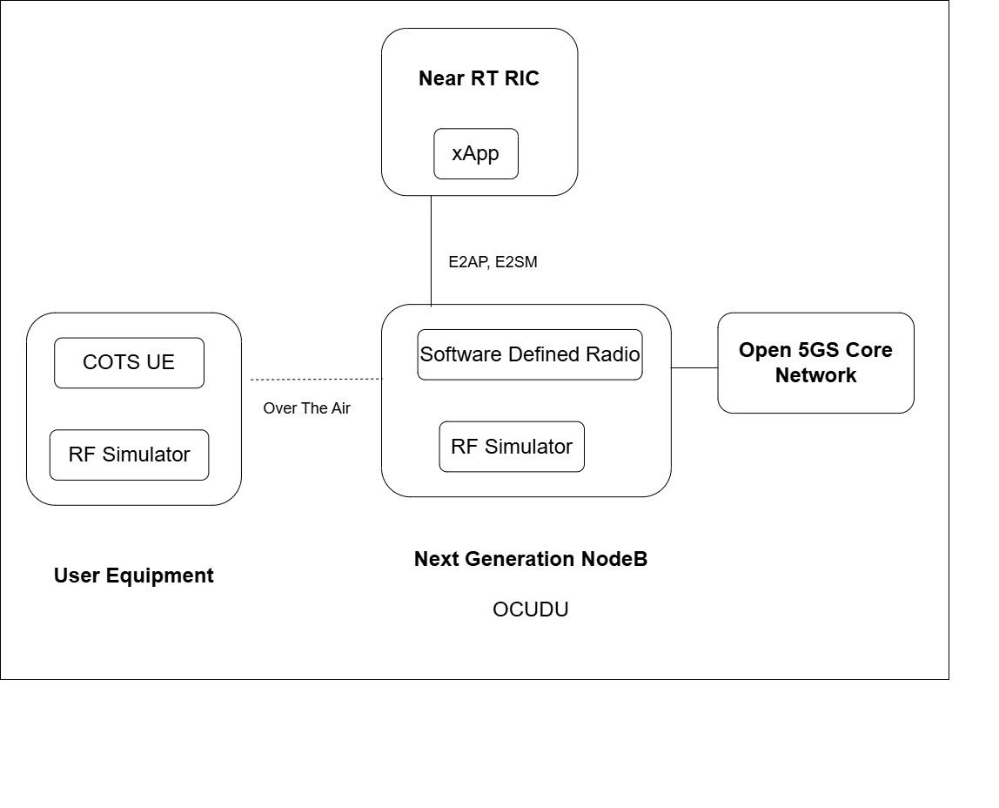
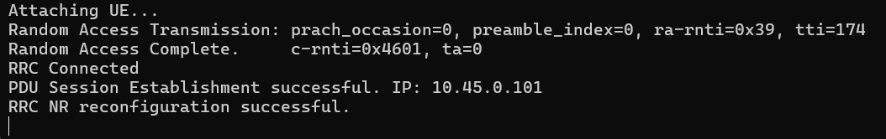
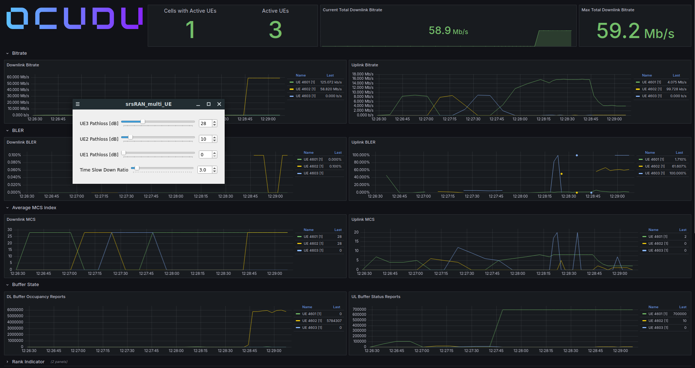
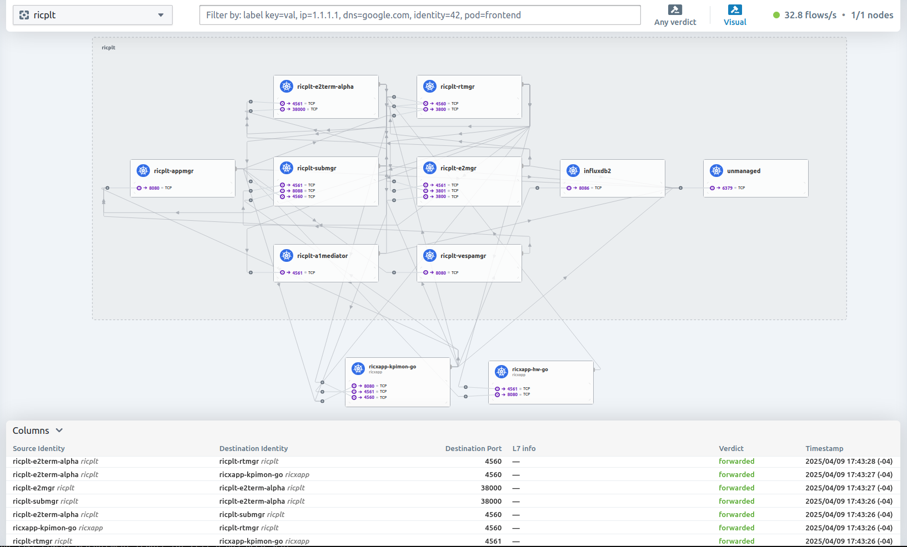
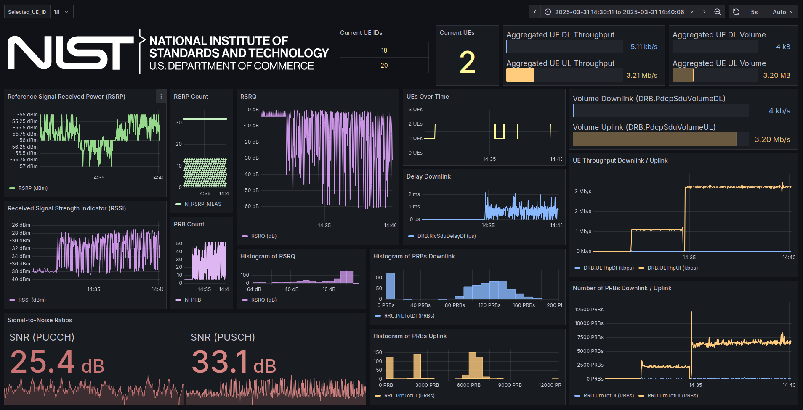

# Automation Tool for Deploying 5G O-RAN Testbeds

The objective of this tutorial is to provide a hands-on, end-to-end guide for deploying and validating an O-RAN compliant 5G testbed using OCUDU, Open5GS, and a Near-RT RIC environment. The tutorial is designed to learn the fundamentals of O-RAN architecture, OCUDU,  E2 integration, and KPI monitoring through a practical deployment workflow.
By completing this tutorial, users will be able to:
- Understand the architecture and components of O-RAN networks.
- Deploy and configure the Open5GS 5G Core.
- Build and deploy OCUDU-based O-CU and O-DU components.
- Integrate a Near-RT RIC with OCUDU.
- Deploy and validate xApps for KPI monitoring.
- Perform UE registration and traffic validation.
- Monitor network KPIs using observability tools.
- Troubleshoot common deployment and connectivity issues.
- Automate deployment workflows for repeatable experimentation and research.

The tutorial aims to provide an accessible and reproducible platform for O-RAN experimentation, telecom automation, and advanced wireless research in public lab and academic environments.

# Key Features

## E2 Telemetry
E2 telemetry enables communication between the OCUDU platform and the Near-RT RIC through the E2 interface defined by O-RAN standards. This interface allows the RIC to collect real-time radio and network performance data from the O-CU and O-DU components.

### Purpose
- Provide visibility into RAN behavior
- Support intelligent RAN optimization
- Enable AI/ML-driven control applications
- Allow xApps to monitor and influence network operations

## KPI Monitoring
KPI (Key Performance Indicator) monitoring provides visibility into the health, performance, and efficiency of the deployed 5G network. KPIs are collected from OCUDU and visualized using monitoring platforms such as Grafana and Prometheus.

### Purpose
- Measure network performance
- Detect congestion or failures
- Validate deployment success
- Analyze user traffic behavior
- Support performance optimization research

### Common KPIs Monitored

| KPI                   | Description                        |
|-----------------------|------------------------------------|
| Downlink Throughput    | DL traffic speed                   |
| Uplink Throughput      | UL traffic speed                   |        |
| UE Count              | Number of connected users          |              |                  |
| CPU Usage             | Platform resource utilization       |
## UE Registration Validation
UE (User Equipment) registration validation confirms that devices can successfully connect to the deployed 5G network through the Open5GS core and OCUDU radio access network. This is one of the most important validation steps in the tutorial because it verifies end-to-end connectivity across the entire O-RAN stack.

### Validation Objectives
The tutorial validates:
- UE authentication
- SIM/subscriber configuration
- AMF communication
- PDU session establishment
- IP address allocation
- Data connectivity

### Expected Outcomes
- UE successfully attaches to the network
- KPIs visible in the RIC dashboard

## Learning Goal
Users should be able to:
- Understand O-RAN architecture
- Deploy Open5GS Core
- Build and configure OCUDU
- Integrate Near-RT RIC
- Enable E2 telemetry
- Deploy KPI monitoring xApps
- Validate UE registration
- Run traffic and KPI tests


## Setting Up a Testbed

The  tool can be used in virtual machines and physical machines with the list of open-source components and minimum system requirements specified below. For additional details on the configuration of physical hardware and individual software components, refer to [\[1\]][nist-tn-2311].

### Supported Testbed Open-Source Components

<!div align="center">
  
  
</div>

This tool supports the deployment of 5G O-RAN testbeds using open-source components, OCUDU with O-RAN SC's Near-RT RIC. Below is the list of the supported testbed open-source components.

```text
CU/DU
└──  OCUDU: 26.04
RICs
├── O-RAN SC Near-RT RIC: M-Release
│   └── xApps
│       └──  KPM Monitor xApp
5G Core
└──  Open5GS: v2.7.7

UEs
└──  srsRAN_4G: release_25_10
```


### Minimum System Requirements

Before beginning the installation and setup of the testbed, verify that the system meets the following minimum specifications to prevent issues like pods remaining in pending or crash loop states if using an O-RAN SC RIC.

- **Operating System**: Linux distributions based on Ubuntu 20.04 LTS, Ubuntu 22.04 LTS, Ubuntu 24.04 LTS, and Ubuntu 26.04 LTS are supported.
  - _Recommendation: Ubuntu 22.04._
- **Hard Drive Storage**: Must be `≥ 57` GB.
- **Base Memory/RAM**: Must be `≥ 6000` MB.
- **Number of Processors**: Must be `≥ 2` processors.
  - _Recommendation: `≥ 6` processors._
- **Internet Connectivity**: A stable internet connection must be maintained during the installation otherwise the process may fail and require restarting.


## Installation Guide

Run the Update Manager to get packages up-to-date, then reboot.

```console
sudo apt-get update && sudo apt-get upgrade -y
```

If using VirtualBox, insert the Guest Additions CD image and install the Guest Additions with the on-screen prompt or the following commands, then reboot.

```console
sudo apt-get install -y dkms build-essential linux-headers-generic linux-headers-$(uname -r)
sudo mkdir /media/cdrom
sudo mount /dev/cdrom /media/cdrom
cd /media/cdrom
sudo ./VBoxLinuxAdditions.run
sudo adduser $USER vboxsf
```

Next, install Git and clone the O-RAN-Testbed-Automation repository over HTTPS.

```console
sudo apt-get install -y git
git clone https://gitlab.nist.gov/gitlab/wnd-oran/o-ran-testbed-init.git
cd O-RAN-Testbed-Automation
```

Alternatively, the repository may be cloned over SSH: `git@gitlab.nist.gov:wnd-oran/o-ran-testbed-init.git`. To use SSH instead of HTTPS for all subsequent `git clone` operations during the installation, set `export USE_GIT_SSH=true` in your terminal before proceeding.

---

> [!IMPORTANT]
> The deployment scenario based on Open 5GS Cpre, srsRAN and O-RAN SC's Near-RT RIC can be installed from the base directory.

Begin the installation process, recommended to be run as the current user rather than as root:

```console
./full_install.sh
```

> [!TIP]
> Due to `set -e`, the scripts will halt upon encountering an error so that it can be corrected before trying again. Since the scripts are idempotent, only the incomplete steps of the installation process will be executed unless specified otherwise. Please be patient until an error occurs or the testbed installation completes successfully.

```text
################################################################################
# Successfully installed the Near-RT RIC, 5G Core, gNodeB, and UE.             #
################################################################################
```

<details>
  <summary><b>OCUDU and O-RAN SC Near-RT RIC Output</b></summary>
  <hr>

Run the testbed with `./run.sh` to start the 5G Core, gNodeB, and UEs 2 and 3 as background processes, and UE 1 in the foreground. Use `./is_running.sh` to check if the components are running, and `./stop.sh` to stop the components. The optional RIC starts automatically on boot and can be accessed with `k9s -A`.

<div align="center">
  
  
</div>
<!
```console
Attaching UE...
Random Access Transmission: prach_occasion=0, preamble_index=0, ra-rnti=0x39, tti=174
Random Access Complete.     c-rnti=0x4601, ta=0
RRC Connected
PDU Session Establishment successful. IP: 10.45.0.101
RRC NR reconfiguration successful.
```
>

<!--
<b>OCUDU Grafana WebUI and ZMQ Broker Visualization</b><div align="center">
  
</div>

See <a href="Next_Generation_Node_B/README.md#ocudu-grafana-webui">this section</a> for more information.

<b>Supplementary O-RAN SC Network Monitoring, Visualization, and Control</b><div align="center">
  
</div>

See <a href="RAN_Intelligent_Controllers/Near-Real-Time-RIC#migration-to-cilium">this section</a> for the set up guide.
</details>

---


<b>Supplementary Dashboard for KPM Visualization</b><div align="center">
  
</div>

See <a href="OpenAirInterface_Testbed/RAN_Intelligent_Controllers/Flexible-RIC#kpm-monitor-visualization-in-grafana">this section</a> for the set up guide.
</details>

---
-->
</details>

## Software Versioning

For stability of software dependencies, all `git clone` calls are routed through `commit_hashes.json` which specifies a branch and/or commit hash for each repository. This file can be updated manually, or with `./Additional_Scripts/update_commit_hashes.sh` to fetch the latest commit hashes. For information about the automation tool versions, please see the releases page [\[2\]][gh-ota].

## Documentation

For more information about a specific component, refer to the README.md files in the respective subdirectories:
- README.md [\[3\]][gh-readme]
- 5G_Core_Network/README.md [\[4\]][gh-5gcore]
- 5G_Core_Network/Additional_Cores_5GDeploy/README.md [\[5\]][gh-5gdeploy]
- Next_Generation_Node_B/README.md [\[6\]][gh-gnodeb]
- User_Equipment/README.md [\[7\]][gh-ue]
- RAN_Intelligent_Controllers/Near-Real-Time-RIC/README.md [\[8\]][gh-nearrtric]
- RAN_Intelligent_Controllers/Non-Real-Time-RIC/README.md [\[9\]][gh-nonrtric]
- OpenAirInterface_Testbed/README.md [\[10\]][gh-oai]
- OpenAirInterface_Testbed/Next_Generation_Node_B/README.md [\[11\]][gh-oaignb]
- OpenAirInterface_Testbed/User_Equipment/README.md [\[12\]][gh-oaiue]
- OpenAirInterface_Testbed/RAN_Intelligent_Controllers/Flexible-RIC/README.md [\[13\]][gh-flexric]


## References

1. Liu, Peng, Lee, Kyehwan, Cintrón, Fernando J., Wuthier, Simeon, Savaliya, Bhadresh, Montgomery, Douglas, Rouil, Richard (2024). Blueprint for Deploying 5G O-RAN Testbeds: A Guide to Using Diverse O-RAN Software Stacks. National Institute of Standards and Technology. [https://doi.org/10.6028/NIST.TN.2311][nist-tn-2311].
2. Releases, Automation Tool for Deploying 5G O-RAN Testbeds. GitHub. [https://github.com/USNISTGOV/O-RAN-Testbed-Automation/releases][gh-ota].
3. Documentation of Base Directory. [https://github.com/usnistgov/O-RAN-Testbed-Automation/blob/main/README.md][gh-readme]
4. Documentation of 5G Core Network (Open5GS). [https://github.com/usnistgov/O-RAN-Testbed-Automation/blob/main/5G_Core_Network/README.md][gh-5gcore].
5. Documentation of Additional Cores for 5G Deployment. [https://github.com/usnistgov/O-RAN-Testbed-Automation/blob/main/5G_Core_Network/Additional_Cores_5GDeploy/README.md][gh-5gdeploy].
6. Documentation of Next Generation Node B (OCUDU). [https://github.com/usnistgov/O-RAN-Testbed-Automation/blob/main/Next_Generation_Node_B/README.md][gh-gnodeb].
7. Documentation of User Equipment (srsRAN_4G). [https://github.com/usnistgov/O-RAN-Testbed-Automation/blob/main/User_Equipment/README.md][gh-ue].
8. Documentation of Near-Real Time RAN Intelligent Controller (O-RAN SC). [https://github.com/usnistgov/O-RAN-Testbed-Automation/blob/main/RAN_Intelligent_Controllers/Near-Real-Time-RIC/README.md][gh-nearrtric].
9. Documentation of Next Generation Node B (OpenAirInterface). [https://github.com/usnistgov/O-RAN-Testbed-Automation/blob/main/OpenAirInterface_Testbed/Next_Generation_Node_B/README.md][gh-oaignb].
10. Documentation of User Equipment (OpenAirInterface). [https://github.com/usnistgov/O-RAN-Testbed-Automation/blob/main/OpenAirInterface_Testbed/User_Equipment/README.md][gh-oaiue].
11. Documentation of Near-Real Time RAN Intelligent Controller (FlexRIC). [https://github.com/usnistgov/O-RAN-Testbed-Automation/blob/main/OpenAirInterface_Testbed/RAN_Intelligent_Controllers/Flexible-RIC/README.md][gh-flexric].

## <!-- HR 2 -->

<div align="center">
  <a href="https://www.nist.gov" target="_blank">
    <!-- <picture>
      <source media="(prefers-color-scheme: light)" srcset="./Images/125_NIST_Light.png">
      <source media="(prefers-color-scheme: dark)" srcset="./Images/125_NIST_Dark.png">
      
    </picture> -->
    
  </a>
</div>

<!-- References -->

[nist-tn-2311]: https://doi.org/10.6028/NIST.TN.2311
[gh-ota]: https://github.com/USNISTGOV/O-RAN-Testbed-Automation/releases
[gh-readme]: README.md
[gh-5gcore]: 5G_Core_Network/README.md
[gh-5gdeploy]: 5G_Core_Network/Additional_Cores_5GDeploy/README.md
[gh-gnodeb]: Next_Generation_Node_B/README.md
[gh-ue]: User_Equipment/README.md
[gh-nearrtric]: RAN_Intelligent_Controllers/Near-Real-Time-RIC/README.md
[gh-nonrtric]: RAN_Intelligent_Controllers/Non-Real-Time-RIC/README.md
[gh-oai]: OpenAirInterface_Testbed/README.md
[gh-oaignb]: OpenAirInterface_Testbed/Next_Generation_Node_B/README.md
[gh-oaiue]: OpenAirInterface_Testbed/User_Equipment/README.md
[gh-flexric]: OpenAirInterface_Testbed/RAN_Intelligent_Controllers/Flexible-RIC/README.md
[nist-wnd]: https://www.nist.gov/ctl/Wireless-Networks-Division
[nist-oran]: https://www.nist.gov/programs-projects/Open-RAN-Research-NIST
[gh-nsd]: ./NIST%20Software%20Disclaimer.md
[gh-license]: ./LICENSE
