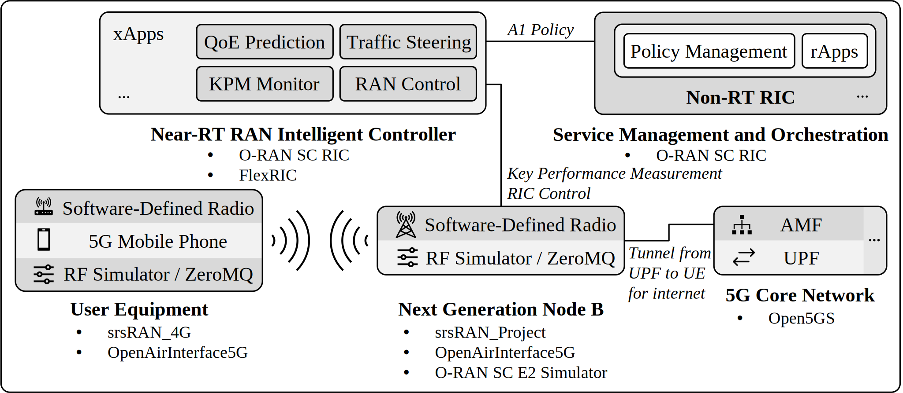
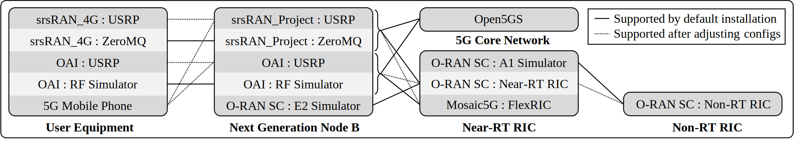

# Automation Tool for Deploying 5G O-RAN Testbeds

Based on the blueprints described in NIST TN 2311 [\[1\]][nist-tn-2311], this automation tool facilitates the deployment and configuration of 5G Open Radio Access Network (O-RAN) testbeds. Designed to operate in both bare metal and virtualized environments, it simplifies setting up the components required for a 5G O-RAN testbed, including the 5G Core; Next Generation Node B (gNodeB) composed of Radio Unit (RU), Distributed Unit (DU), and Centralized Unit (CU); User Equipment (UE); RAN Intelligent Controller (RIC); and a series of xApps that can be installed in the RIC. This reduces the complexity and time required to operationalize the testbeds described in the report above, and enables more efficient testing and validation to facilitate research and development in 5G technologies.

## Setting Up a Testbed

The automation tool can be used in virtual machines and physical machines with the list of open-source components and minimum system requirements specified below. For additional details on the configuration of physical hardware and individual software components, refer to [\[1\]][nist-tn-2311].

### Supported Testbed Open-Source Components

<div align="center">
  <picture>
    <source media="(prefers-color-scheme: light)" srcset="./Images/Architecture_Light.svg">
    <source media="(prefers-color-scheme: dark)" srcset="./Images/Architecture_Dark.svg">
    
  </picture>
  <!--  -->
</div>

This tool supports the deployment of 5G O-RAN testbeds using open-source components in two main scenarios: Software Radio Systems with O-RAN SC's Near-RT RIC, and OpenAirInterface with Mosaic5G's FlexRIC. Below is the list of the supported testbed open-source components.

```text
CU/DU
├── srsRAN_Project gNB: release_25.04
├── OpenAirInterface gNB: 2025.w38
└── O-RAN SC E2 Simulator: L-release
RICs
├── O-RAN SC Near-RT RIC: L-release
│   └── xApps
│       ├── Hello World xApps (Go, Python, and Rust)
│       ├── KPM Monitor xApp
│       ├── 5G Cell Anomaly Detection xApp
│       ├── Anomaly Detection xApp
│       ├── Quality of Experience Predictor xApp
│       ├── RIC Control xApp
│       └── Traffic Steering xApp
├── FlexRIC: v2.0.0
│   └── xApps
│       ├── KPM Monitor xApp (to console, CSV, or InfluxDB)
│       ├── MAC + RLC + PDCP + GTP Monitor xApp
│       ├── RIC Control xApp
│       └── RIC Control Monitor xApp
└── O-RAN SC Non-RT RIC: L-release
    └── Minimal prototype with no rApp support.
5G Core
└── Open5GS: v2.7.6
UEs
├── srsRAN_4G: release_23_11
└── OpenAirInterface 5G UE: 2025.w38
```

The components that have been verified to support or not support connectivity are included below.

<div align="center">
  <picture>
    <source media="(prefers-color-scheme: light)" srcset="./Images/Support_Light.svg">
    <source media="(prefers-color-scheme: dark)" srcset="./Images/Support_Dark.svg">
    
  </picture>
  <!--  -->
</div>

### Minimum System Requirements

Before beginning the installation and setup of the testbed, verify that the system meets the following minimum specifications to prevent issues like pods remaining in pending or crash loop states if using an O-RAN SC RIC.

- **Operating System**: Linux distributions based on Ubuntu 20.04 LTS, Ubuntu 22.04 LTS, and Ubuntu 24.04 LTS are supported.
  - _Recommendation: Ubuntu 22.04._
- **Hard Drive Storage**: Must be `≥ 57` GB.
- **Base Memory/RAM**: Must be `≥ 6000` MB.
- **Number of Processors**: Must be `≥ 2` processors.
  - _Recommendation: `≥ 6` processors._
- **Internet Connectivity**: A stable internet connection must be maintained during the installation otherwise the process may fail and require restarting.

### Virtual Machine Preferences

For users using a virtual machine, e.g., VirtualBox, the following configuration parameters may be considered.

- **System**
  - **Extended Features**: Check `Enable I/O APIC` to improve interrupt handling.
  - **Extended Features**: Check `Enable PAE/NX` and if possible, also check `Enable Nested VT-x/AMD-V`.
  - **Paravirtualization Interface**: Select `Default`.
  - **Hardware Virtualization**: Check `Enabled Nested Paging`.
- **Display**
  - **Video Memory**: Set the slider to the maximum if using a Desktop environment.
- **Storage**
  - Check the SATA controller's `Solid-state Drive` option if using an SSD hard drive.
- **Network**
  - **Attached to**: Select `NAT` to allow the components to communicate locally.

---

## Installation Guide

Run the Update Manager to get packages up-to-date, then reboot.

```console
sudo apt-get update && sudo apt-get upgrade -y
```

If using VirtualBox, insert the Guest Additions CD image and install the Guest Additions with the on-screen prompt or the following commands, then reboot.

```console
sudo apt-get install -y dkms build-essential linux-headers-generic linux-headers-$(uname -r)
sudo mkdir /media/cdrom
sudo mount /dev/cdrom /media/cdrom
cd /media/cdrom
sudo ./VBoxLinuxAdditions.run
sudo adduser $USER vboxsf
```

Next, install Git and clone the O-RAN-Testbed-Automation repository over HTTPS.

```console
sudo apt-get install -y git
git clone https://github.com/USNISTGOV/O-RAN-Testbed-Automation.git
cd O-RAN-Testbed-Automation
```

Alternatively, the repository may be cloned over SSH: `git clone git@github.com:USNISTGOV/O-RAN-Testbed-Automation.git`

---

> [!IMPORTANT]
> The deployment scenario based on OpenAirInterface with FlexRIC can be installed from the `OpenAirInterface_Testbed` directory, while the deployment scenario based on srsRAN and O-RAN SC's Near-RT RIC can be installed from the base directory.

Begin the installation process, recommended to be run as the current user rather than as root:

```console
./full_install.sh
```

> [!TIP]
> Due to `set -e`, the scripts will halt upon encountering an error so that it can be corrected before trying again. Since the scripts are idempotent, only the incomplete steps of the installation process will be executed unless specified otherwise. Please be patient until an error occurs or the testbed installation completes successfully.

```text
################################################################################
# Successfully installed the Near-RT RIC, 5G Core, gNodeB, and UE.             #
################################################################################
```

<details>
  <summary><b>Software Radio Systems and O-RAN SC Near-RT RIC Output</b></summary>
  <hr>

Run the testbed with `./run.sh` to start the 5G Core and gNodeB as background processes, and the UE in the foreground. Use `./is_running.sh` to check if the components are running, and `./stop.sh` to stop the components. The RIC starts automatically on boot and can be accessed with `k9s -A`.

```console
Attaching UE...
Random Access Transmission: prach_occasion=0, preamble_index=0, ra-rnti=0x39, tti=4174
Random Access Complete.     c-rnti=0x4601, ta=0
RRC Connected
PDU Session Establishment successful. IP: 10.45.0.2
RRC NR reconfiguration successful.
```

<b>Supplementary Network Monitoring, Visualization, and Control</b><div align="center">
  
</div>

See <a href="RAN_Intelligent_Controllers/Near-Real-Time-RIC#migration-to-cilium">this section</a> for the set up guide.
</details>

---

<details>
  <summary><b>OpenAirInterface and FlexRIC Output</b></summary>
  <hr>

Run the testbed with `./run.sh` to start the 5G Core, FlexRIC, gNodeB, and UE as background processes, and the KPM monitoring xApp in the foreground. Use `./is_running.sh` to check if the components are running, and `./stop.sh` to stop the components.

```console
8 KPM ind_msg latency = 600 [μs]
UE ID type = gNB, amf_ue_ngap_id = 1
ran_ue_id = 1
DRB.PdcpSduVolumeDL = 0 [kb]
DRB.PdcpSduVolumeUL = 0 [kb]
DRB.RlcSduDelayDl = 0.00 [μs]
DRB.UEThpDl = 0.00 [kbps]
DRB.UEThpUl = 0.00 [kbps]
RRU.PrbTotDl = 15 [PRBs]
RRU.PrbTotUl = 140 [PRBs]
RSRP = -44.00 [dBm]
...
```

<b>Supplementary Dashboard for KPM Visualization</b><div align="center">
  
</div>

See <a href="OpenAirInterface_Testbed/RAN_Intelligent_Controllers/Flexible-RIC#kpm-monitor-visualization-in-grafana">this section</a> for the set up guide.
</details>

---

## Software Versioning

For stability of software dependencies, all `git clone` calls are routed through `commit_hashes.json` which specifies a branch and/or commit hash for each repository. This file can be updated manually, or with `./Additional_Scripts/update_commit_hashes.sh` to fetch the latest commit hashes. For information about the automation tool versions, please see the releases page [\[2\]][gh-ota].

## Documentation

For more information about a specific component, refer to the README.md files in the respective subdirectories:
- README.md [\[3\]][gh-readme]
- 5G_Core_Network/README.md [\[4\]][gh-5gcore]
- 5G_Core_Network/Additional_Cores_5GDeploy/README.md [\[5\]][gh-5gdeploy]
- Next_Generation_Node_B/README.md [\[6\]][gh-gnodeb]
- User_Equipment/README.md [\[7\]][gh-ue]
- RAN_Intelligent_Controllers/Near-Real-Time-RIC/README.md [\[8\]][gh-nearrtric]
- RAN_Intelligent_Controllers/Non-Real-Time-RIC/README.md [\[9\]][gh-nonrtric]
- OpenAirInterface_Testbed/README.md [\[10\]][gh-oai]
- OpenAirInterface_Testbed/Next_Generation_Node_B/README.md [\[11\]][gh-oaignb]
- OpenAirInterface_Testbed/User_Equipment/README.md [\[12\]][gh-oaiue]
- OpenAirInterface_Testbed/RAN_Intelligent_Controllers/Flexible-RIC/README.md [\[13\]][gh-flexric]

## Contact Information

USNISTGOV/O-RAN-Testbed-Automation is developed and maintained by the NIST Wireless Networks Division [\[14\]][nist-wnd], as part of their Open RAN Research Program [\[15\]][nist-oran].  Contacts for this software:

- Simeon J. Wuthier, @Simewu
- Fernando J. Cintrón, @fjcintron
- Doug Montgomery, @dougm-nist

## NIST Disclaimers

- **NIST Software Disclaimer** [\[16\]][gh-nsd]
- **Fair Use and Licensing Statements of NIST Data/Works** [\[17\]][gh-license]

## References

1. Liu, Peng, Lee, Kyehwan, Cintrón, Fernando J., Wuthier, Simeon, Savaliya, Bhadresh, Montgomery, Douglas, Rouil, Richard (2024). Blueprint for Deploying 5G O-RAN Testbeds: A Guide to Using Diverse O-RAN Software Stacks. National Institute of Standards and Technology. [https://doi.org/10.6028/NIST.TN.2311][nist-tn-2311].
2. Releases, Automation Tool for Deploying 5G O-RAN Testbeds. GitHub. [https://github.com/USNISTGOV/O-RAN-Testbed-Automation/releases][gh-ota].
3. Documentation of Base Directory. [https://github.com/usnistgov/O-RAN-Testbed-Automation/blob/main/README.md][gh-readme]
4. Documentation of 5G Core Network (Open5GS). [https://github.com/usnistgov/O-RAN-Testbed-Automation/blob/main/5G_Core_Network/README.md][gh-5gcore].
5. Documentation of Additional Cores for 5G Deployment. [https://github.com/usnistgov/O-RAN-Testbed-Automation/blob/main/5G_Core_Network/Additional_Cores_5GDeploy/README.md][gh-5gdeploy].
6. Documentation of Next Generation Node B (srsRAN_Project). [https://github.com/usnistgov/O-RAN-Testbed-Automation/blob/main/Next_Generation_Node_B/README.md][gh-gnodeb].
7. Documentation of User Equipment (srsRAN_4G). [https://github.com/usnistgov/O-RAN-Testbed-Automation/blob/main/User_Equipment/README.md][gh-ue].
8. Documentation of Near-Real Time RAN Intelligent Controller (O-RAN SC). [https://github.com/usnistgov/O-RAN-Testbed-Automation/blob/main/RAN_Intelligent_Controllers/Near-Real-Time-RIC/README.md][gh-nearrtric].
9. Documentation of Non-Real Time RAN Intelligent Controller (O-RAN SC). [https://github.com/usnistgov/O-RAN-Testbed-Automation/blob/main/RAN_Intelligent_Controllers/Non-Real-Time-RIC/README.md][gh-nonrtric].
10. Documentation of OpenAirInterface Testbed. [https://github.com/usnistgov/O-RAN-Testbed-Automation/blob/main/OpenAirInterface_Testbed/README.md][gh-oai].
11. Documentation of Next Generation Node B (OpenAirInterface). [https://github.com/usnistgov/O-RAN-Testbed-Automation/blob/main/OpenAirInterface_Testbed/Next_Generation_Node_B/README.md][gh-oaignb].
12. Documentation of User Equipment (OpenAirInterface). [https://github.com/usnistgov/O-RAN-Testbed-Automation/blob/main/OpenAirInterface_Testbed/User_Equipment/README.md][gh-oaiue].
13. Documentation of Near-Real Time RAN Intelligent Controller (FlexRIC). [https://github.com/usnistgov/O-RAN-Testbed-Automation/blob/main/OpenAirInterface_Testbed/RAN_Intelligent_Controllers/Flexible-RIC/README.md][gh-flexric].
14. Wireless Networks Division. National Institute of Standards and Technology. [https://www.nist.gov/ctl/Wireless-Networks-Division][nist-wnd].
15. Open RAN Research at NIST. National Institute of Standards and Technology. [https://www.nist.gov/programs-projects/Open-RAN-Research-NIST][nist-oran].
16. NIST Software Disclaimer. [https://github.com/usnistgov/O-RAN-Testbed-Automation/blob/main/NIST Software Disclaimer.md][gh-nsd].
17. Fair Use and Licensing Statements of NIST Data/Works: [https://github.com/usnistgov/O-RAN-Testbed-Automation/blob/main/LICENSE][gh-license].

## <!-- HR 2 -->

<div align="center">
  <a href="https://www.nist.gov" target="_blank">
    <picture>
      <source media="(prefers-color-scheme: light)" srcset="./Images/NIST_Light.png">
      <source media="(prefers-color-scheme: dark)" srcset="./Images/NIST_Dark.png">
      
    </picture>
    <!--  -->
  </a>
</div>

<!-- References -->

[nist-tn-2311]: https://doi.org/10.6028/NIST.TN.2311
[gh-ota]: https://github.com/USNISTGOV/O-RAN-Testbed-Automation/releases
[gh-readme]: README.md
[gh-5gcore]: 5G_Core_Network/README.md
[gh-5gdeploy]: 5G_Core_Network/Additional_Cores_5GDeploy/README.md
[gh-gnodeb]: Next_Generation_Node_B/README.md
[gh-ue]: User_Equipment/README.md
[gh-nearrtric]: RAN_Intelligent_Controllers/Near-Real-Time-RIC/README.md
[gh-nonrtric]: RAN_Intelligent_Controllers/Non-Real-Time-RIC/README.md
[gh-oai]: OpenAirInterface_Testbed/README.md
[gh-oaignb]: OpenAirInterface_Testbed/Next_Generation_Node_B/README.md
[gh-oaiue]: OpenAirInterface_Testbed/User_Equipment/README.md
[gh-flexric]: OpenAirInterface_Testbed/RAN_Intelligent_Controllers/Flexible-RIC/README.md
[nist-wnd]: https://www.nist.gov/ctl/Wireless-Networks-Division
[nist-oran]: https://www.nist.gov/programs-projects/Open-RAN-Research-NIST
[gh-nsd]: ./NIST%20Software%20Disclaimer.md
[gh-license]: ./LICENSE
