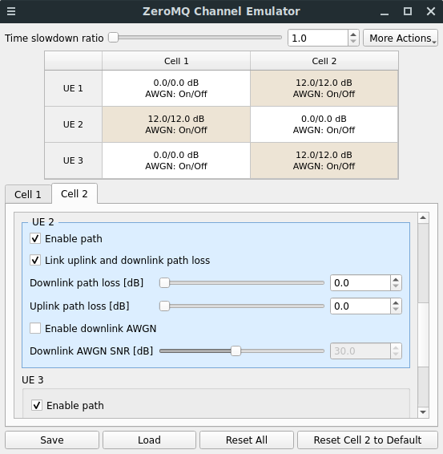
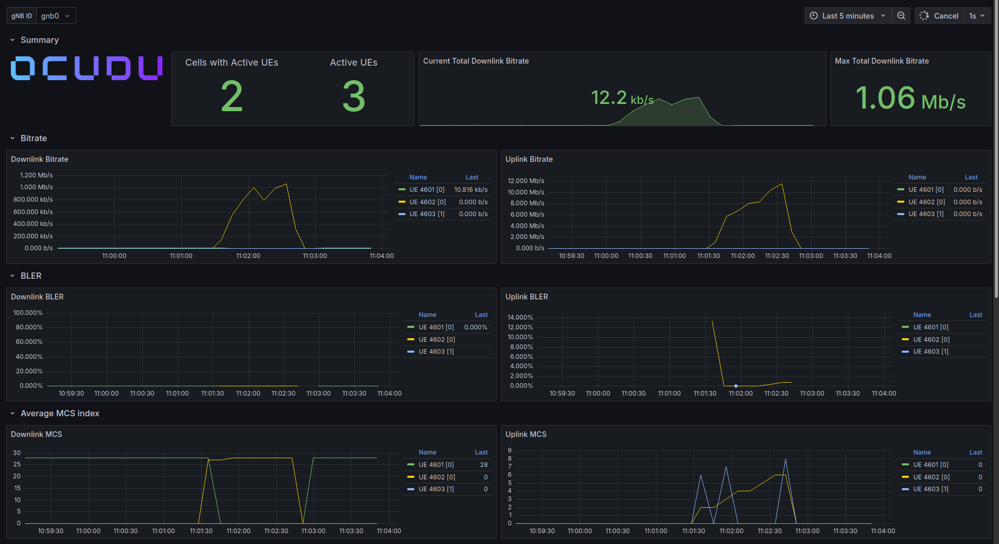
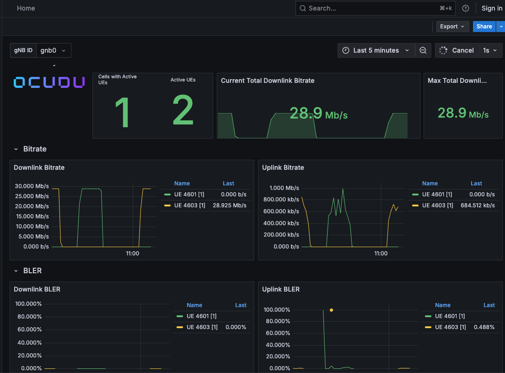

# Deploying OCUDU gNB with Multiple Cells and UEs, Grafana Monitoring, and Traffic Simulation

## Table of Contents

- [Overview](#overview)
- [Prerequisites](#prerequisites)
- [Clone Repository](#clone-repository)
- [Install the Testbed](#install-the-testbed)
- [Start the Testbed](#start-the-testbed)
- [Verify Network Connectivity](#verify-network-connectivity)
- [Launch Grafana](#launch-grafana)
- [Traffic Simulation](#traffic-simulation)
- [Observe Grafana Metrics](#observe-grafana-metrics)
- [Troubleshooting Traffic](#troubleshooting-traffic)
- [Verify Multiple UEs and Cells](#verify-multiple-ues-and-cells)
- [Useful Commands](#useful-commands)
- [Expected Results](#expected-results)
- [Troubleshooting](#troubleshooting)
- [Learning Outcomes](#learning-outcomes)

## Overview

This tutorial demonstrates the deployment and validation of an end-to-end Open RAN 5G standalone (SA) network using the NIST O-RAN Testbed Automation framework. The example deploys an OCUDU gNB with two cells, three simulated srsRAN UEs, an Open5GS 5G Core Network, and an O-RAN SC Near-RT RIC environment. Automated scripts and Kubernetes-based services provide a repeatable environment for research, development, and performance evaluation.

After deployment, each UE connects to a serving cell through the ZeroMQ channel emulator, completes registration and PDU session establishment, and receives an IP address from the 5G Core Network. The tutorial uses `ping` and `iperf3` to generate and evaluate user-plane traffic. Grafana displays network performance indicators, including UE throughput, packet rate, latency, packet loss, CQI, modulation and coding scheme (MCS), and active UE statistics.

The deployment consists of:

- Open5GS Core Network
- OCUDU gNB
- srsRAN UE software
- O-RAN SC Near-RT RIC
- Grafana Monitoring
- Simulated user traffic

At the end of this tutorial you will be able to

- Deploy a complete 5G network
- Configure multiple cells
- Attach multiple UEs
- Verify connectivity
- Generate network traffic
- Observe KPIs in Grafana
- Monitor packet throughput and latency

---

## Prerequisites

- A supported Ubuntu-based Linux distribution; see the [minimum system requirements](../README.md#minimum-system-requirements)

---

## Clone Repository

```bash
git clone https://github.com/USNISTGOV/O-RAN-Testbed-Automation.git

cd O-RAN-Testbed-Automation
```

---

## Install the Testbed

```bash
./full_install.sh
```
```console
################################################################################
# Successfully installed the Near-RT RIC, 5G Core, gNodeB, and UE.             #
################################################################################
```

The installation deploys

- Open5GS
- OCUDU
- srsRAN UE software
- Kubernetes components
- O-RAN SC Near-RT RIC

---

## Start the Testbed

Generate matching configurations for UEs 1, 2, and 3, cells 1 and 2, and the ZeroMQ channel emulator:

```bash
./generate_configurations.sh --ues 1,2,3 --cells 1,2
./run.sh
```

The following channel emulator interface should appear, showing that UE 1 connects to Cell 1, UE 2 connects to Cell 2, and UE 3 connects to Cell 1.
<div align="center">
  
</div>

Example UE 1 output from a successful run:

```console
Opening 1 channels in RF device=zmq with args=tx_port=tcp://*:2101,rx_port=tcp://10.201.0.5:2100,base_srate=23.04e6,id=ue1
Supported RF device list: UHD zmq file
CHx base_srate=23.04e6
CHx id=ue1
Current sample rate is 1.92 MHz with a base rate of 23.04 MHz (x12 decimation)
CH0 rx_port=tcp://10.201.0.5:2100
CH0 tx_port=tcp://*:2101
Current sample rate is 23.04 MHz with a base rate of 23.04 MHz (x1 decimation)
Current sample rate is 23.04 MHz with a base rate of 23.04 MHz (x1 decimation)
Waiting PHY to initialize ... done!
Attaching UE...
Random Access Transmission: prach_occasion=0, preamble_index=41, ra-rnti=0x39, tti=174
Random Access Complete.     c-rnti=0x4602, ta=0
RRC Connected
PDU Session Establishment successful. IP: 10.45.0.101
RRC NR reconfiguration successful.
```

---

## Verify Network Connectivity

Each UE runs in its own Linux network namespace. Open a shell for UE 1 from the top-level directory of the repository:

```bash
./User_Equipment/additional_scripts/open_ue_shell.sh 1
```

Run the connectivity check inside that shell:

```bash
ping 10.45.0.1 -c 3
```

Example output from a successful run:

```console
PING 10.45.0.1 (10.45.0.1) 56(84) bytes of data.
64 bytes from 10.45.0.1: icmp_seq=1 ttl=64 time=194 ms
64 bytes from 10.45.0.1: icmp_seq=2 ttl=64 time=199 ms
64 bytes from 10.45.0.1: icmp_seq=3 ttl=64 time=257 ms

--- 10.45.0.1 ping statistics ---
3 packets transmitted, 3 received, 0% packet loss, time 2003ms
rtt min/avg/max/mdev = 194.499/216.813/256.660/28.243 ms
```

The replies and `0% packet loss` confirm connectivity to the Open5GS user-plane gateway. Use `exit` to return to the host shell, and repeat the command with UE number `2` or `3` to check connectivity with the other UEs.

---

## Launch Grafana

To visualize the performance metrics, start the Grafana WebUI.

- **Start Grafana WebUI**: Start the dashboard and its Docker Compose dependencies with `./Next_Generation_Node_B/start_grafana_webui.sh`.
- **Stop Grafana WebUI**: Stop the dashboard container with `./Next_Generation_Node_B/stop_grafana_webui.sh`.

The dashboard is hosted at:
```
http://localhost:3300
```

Default credentials

```
admin
admin
```

Useful dashboards include:

- UE throughput
- Packet loss
- Latency
- Cell KPIs
- Downlink MCS
- Uplink MCS
- CQI

The panels receive data when one or more UEs are generating traffic.

---

## Traffic Simulation

The following manual `iperf3` tests generate uplink and downlink traffic between UE 1 and the Open5GS user-plane gateway.

<b>OCUDU Grafana WebUI Visualization</b><div align="center">
  
</div>

### Install iperf3

Install `iperf3` on the host if it is not already available:

```bash
sudo apt update
sudo apt install iperf3
```

### Start the iperf3 Server

In one host terminal, start the server on the Open5GS user-plane gateway address:

```bash
iperf3 -s -B 10.45.0.1
```
Example output from a successful run:

```console
iperf3 -s -B 10.45.0.1
-----------------------------------------------------------
Server listening on 5201
-----------------------------------------------------------
Accepted connection from 10.45.0.101, port 50034
[  5] local 10.45.0.1 port 5201 connected to 10.45.0.101 port 50038
[ ID] Interval           Transfer     Bitrate
[  5]   0.00-2.00   sec   384 KBytes  1.57 Mbits/sec
[  5]   2.00-3.53   sec   384 KBytes  2.06 Mbits/sec
[  5]   3.53-4.54   sec   256 KBytes  2.08 Mbits/sec
[  5]   4.54-5.44   sec   256 KBytes  2.34 Mbits/sec
[  5]   5.44-6.84   sec   384 KBytes  2.25 Mbits/sec
```

### Generate Uplink Traffic

In another host terminal, run the `iperf3` client in the UE 1 namespace:

```bash
sudo ip netns exec ue1 iperf3 -c 10.45.0.1 -t 60
```

> [!NOTE]
> This can also be done by opening a shell in the UE namespace.

Example output from a successful run:

```console
sudo ip netns exec ue1 iperf3 -c 10.45.0.1 -t 60
Connecting to host 10.45.0.1, port 5201
[  5] local 10.45.0.101 port 50038 connected to 10.45.0.1 port 5201
[ ID] Interval           Transfer     Bitrate         Retr  Cwnd
[  5]   0.00-1.00   sec   437 KBytes  3.58 Mbits/sec    1   73.5 KBytes
[  5]   1.00-2.00   sec   272 KBytes  2.22 Mbits/sec    0   86.3 KBytes
[  5]   2.00-3.00   sec   382 KBytes  3.13 Mbits/sec    0   99.0 KBytes
[  5]   3.00-4.00   sec   255 KBytes  2.08 Mbits/sec    0    112 KBytes
[  5]   4.00-5.00   sec   509 KBytes  4.18 Mbits/sec    0    124 KBytes
```

This sends traffic from the UE to the 5G Core for 60 seconds.


### Generate Downlink Traffic

Leave the core network `iperf3` server running. Now use reverse mode to send traffic from the server to UE 1:

```bash
sudo ip netns exec ue1 iperf3 -c 10.45.0.1 -R -t 30
```

Example output from a successful run:

```console
Connecting to host 10.45.0.1, port 5201
Reverse mode, remote host 10.45.0.1 is sending
[  5] local 10.45.0.101 port 36996 connected to 10.45.0.1 port 5201
[ ID] Interval           Transfer     Bitrate
[  5]   0.00-1.00   sec  1.50 MBytes  12.6 Mbits/sec
[  5]   1.00-2.04   sec  2.00 MBytes  16.1 Mbits/sec
[  5]   2.04-3.04   sec  1.75 MBytes  14.7 Mbits/sec
[  5]   3.04-4.00   sec  1.75 MBytes  15.2 Mbits/sec
[  5]   4.00-5.00   sec  1.75 MBytes  14.7 Mbits/sec
[  5]   5.00-6.05   sec  1.38 MBytes  11.1 Mbits/sec
```

The `-R` option reverses the direction so the 5G Core sends traffic to the UE.


### Scripted Alternative

For simpler traffic generation, the UE scripts select the namespace and PDU session automatically. These scripts use `iperf` (iperf2), rather than `iperf3`, and accept the UE number, target bandwidth, and duration in seconds:

```bash
./User_Equipment/additional_scripts/simulate_ue_traffic_to_core.sh 1 1M 60
```
```bash
./User_Equipment/additional_scripts/simulate_core_traffic_to_ue.sh 1 1M 60
```

Throughput depends on:

- Host CPU resources
- Network configuration
- gNB configuration
- Channel emulator settings

---

## Observe Grafana Metrics

While running `ping`, the manual `iperf3` test, or either `iperf` traffic script, monitor the Grafana dashboard.

Expected changes:

- UE throughput
- Packet rate
- Latency
- Active UE statistics

---

## Troubleshooting Traffic

If no traffic is observed, open the UE shell:

```bash
./User_Equipment/additional_scripts/open_ue_shell.sh 1
```

Repeat the connectivity check above, then inspect the UE interfaces:

```bash
ip addr
```

Example output from a successful run:

```console
1: lo: <LOOPBACK,UP,LOWER_UP> mtu 65536 qdisc noqueue state UNKNOWN group default qlen 1000
    link/loopback 00:00:00:00:00:00 brd 00:00:00:00:00:00
    inet 127.0.0.1/8 scope host lo
       valid_lft forever preferred_lft forever
    inet6 ::1/128 scope host
       valid_lft forever preferred_lft forever
2: tun_srsue: <POINTOPOINT,MULTICAST,NOARP,UP,LOWER_UP> mtu 1500 qdisc fq_codel state UNKNOWN group default qlen 500
    link/none
    inet 10.45.0.101/24 scope global tun_srsue
       valid_lft forever preferred_lft forever
```

The `tun_srsue` interface should be up and have a PDU address. If it is missing or has no address, the PDU session was not established.

Check the routes from the same shell:

```bash
ip route
```

Example output from a successful run:

```console
default via 10.201.0.5 dev v-ue1
10.45.0.0/24 dev tun_srsue proto kernel scope link src 10.45.0.101
10.201.0.4/30 dev v-ue1 proto kernel scope link src 10.201.0.6
```

The routing table should include the PDU subnet. Run `exit` to return to the host.

## Verify Multiple UEs and Cells

The configuration generated earlier uses UEs 1, 2, and 3 with cells 1 and 2. Verify the running components with:

```bash
./is_running.sh
```

The output should report all three UEs, the gNodeB, and the ZeroMQ channel emulator as running. Generate traffic for each UE separately to compare their measurements in Grafana.

Both cells are configured even if Grafana initially reports only one cell with active UEs. That panel counts cells currently serving a UE; UE-to-cell paths can be adjusted in the ZeroMQ channel emulator interface.

List the PDU session addresses assigned to the running UEs with:

```bash
./User_Equipment/additional_scripts/get_all_pdu_sessions.sh
```

The dashboard below shows two active UEs. The number of active UEs can differ from the number configured.

<b>Multiple UEs in Grafana dashboard</b><div align="center">
  
</div>


For more information, see [Simulating Multiple UEs and Cells with a ZeroMQ Channel Emulator](../Next_Generation_Node_B/README.md#simulating-multiple-ues-and-cells-with-a-zeromq-channel-emulator).

## Useful Commands

Check Kubernetes

```bash
kubectl get pods -A
```
```console
NAMESPACE      NAME                                                        READY   STATUS    RESTARTS       AGE
kube-flannel   kube-flannel-ds-r8mkz                                       1/1     Running   0              4d2h
kube-system    coredns-674b8bbfcf-8nvvv                                    1/1     Running   1 (88m ago)    4d2h
kube-system    coredns-674b8bbfcf-xzrdf                                    1/1     Running   1 (88m ago)    4d2h
kube-system    etcd-ip-172-31-18-66                                        1/1     Running   32             4d2h
kube-system    kube-apiserver-ip-172-31-18-66                              1/1     Running   16             4d2h
kube-system    kube-controller-manager-ip-172-31-18-66                     1/1     Running   32 (92m ago)   4d2h
kube-system    kube-proxy-xjrs2                                            1/1     Running   0              4d2h
kube-system    kube-scheduler-ip-172-31-18-66                              1/1     Running   30 (92m ago)   4d2h
ricinfra       deployment-tiller-ricxapp-84b87b8c64-g4rdf                  1/1     Running   2 (88m ago)    4d2h
ricplt         deployment-ricplt-a1mediator-f4888dfd7-755pg                1/1     Running   1 (88m ago)    4d2h
ricplt         deployment-ricplt-alarmmanager-7f984cdf77-bmw2f             1/1     Running   1 (88m ago)    4d2h
ricplt         deployment-ricplt-appmgr-549d488cb8-lh46g                   1/1     Running   1 (88m ago)    4d2h
ricplt         deployment-ricplt-e2mgr-7d9f845865-68hz4                    1/1     Running   2 (88m ago)    4d2h
ricplt         deployment-ricplt-e2term-alpha-55ff9df9d9-btfz7             1/1     Running   1 (88m ago)    4d2h
ricplt         deployment-ricplt-o1mediator-6fb8f84c97-t64ml               1/1     Running   1 (88m ago)    4d2h
ricplt         deployment-ricplt-rtmgr-668f86855f-q9pg5                    1/1     Running   2 (88m ago)    4d2h
ricplt         deployment-ricplt-submgr-5b8796c997-zfcv9                   1/1     Running   1 (88m ago)    4d2h
ricplt         deployment-ricplt-vespamgr-848f7bb874-fhc8t                 1/1     Running   1 (88m ago)    4d2h
ricplt         r4-infrastructure-kong-78657d8f48-f2sjr                     2/2     Running   2 (88m ago)    4d2h
ricplt         r4-infrastructure-prometheus-alertmanager-b9cc56766-c5xhh   2/2     Running   2 (88m ago)    4d2h
ricplt         r4-infrastructure-prometheus-server-6476958975-25ssr        1/1     Running   4              4d2h
ricplt         statefulset-ricplt-dbaas-server-0                           1/1     Running   1 (88m ago)    4d2h
ricxapp        ricxapp-hw-go-c84579888-hrf2p                               1/1     Running   1 (88m ago)    4d2h
```

Stop testbed

```bash
./stop.sh
```

Restart

```bash
./run.sh
```

---

## Expected Results

Successful deployment should show

- UEs attached
- PDU sessions established
- Core network connectivity
- Active Grafana dashboard
- Live KPIs
- Traffic visible
- Near-RT RIC operational

---

## Troubleshooting

### UE does not attach

Check

```bash
./is_running.sh
```

Verify that the output reports UEs 1, 2, and 3, the ZeroMQ channel emulator, and the gNodeB as running.

If a component is not running, restart the testbed:


```bash
./stop.sh
./run.sh
```

---

### Grafana empty
If Grafana does not display metrics, check its status:

```bash
./Next_Generation_Node_B/is_running.sh
```

To inspect the Grafana container directly, run:

```bash
docker ps | grep grafana
```

Example output from a successful run:

```console
03b793312bd8   ocudu/grafana         "/run.sh"                33 seconds ago   Up 16 seconds             0.0.0.0:3300->3000/tcp, [::]:3300->3000/tcp   ocudu-grafana
```

If Grafana is not running, restart the dashboard:

```bash
./Next_Generation_Node_B/start_grafana_webui.sh
```
---

## Learning Outcomes

After completing this tutorial you will understand

- Open RAN architecture
- OCUDU deployment
- UE attachment procedure
- PDU session establishment
- KPI monitoring
- Grafana dashboards
- Traffic generation
- Network performance analysis
