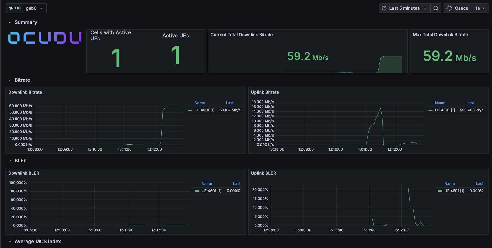

# Deploying  OCUDU gNB with One UE, Grafana Monitoring, and Traffic Simulation

# Table of Contents

- [Overview](#overview)
- [Prerequisites](#prerequisites)
- [Install the Testbed](#install-the-testbed)
- [Start the Testbed](#start-the-testbed)
- [Launch Grafana](#launch-grafana)
- [Traffic Simulation](#traffic-simulation)
- [Multiple UE Deployment](#multiple-ue-deployment)
- [Useful Commands](#useful-commands)
- [Troubleshooting](#troubleshooting)
- [Learning Outcomes](#learning-outcomes)

## Overview

This tutorial demonstrates how to deploy a complete Open RAN testbed using the NIST O-RAN Testbed Automation framework.

The deployment consists of:

- Open5GS Core Network
- OCUDU gNB
- One UE (srsRAN UE)
- O-RAN SC Near-RT RIC
- Grafana Monitoring
- Simulated user traffic using ping and iperf3

At the end of this tutorial you will be able to

- Deploy a complete 5G network
- Attach one UE
- Verify connectivity
- Generate network traffic
- Observe KPIs in Grafana
- Monitor packet throughput and latency

---


## Prerequisites

Ubuntu 22.04 LTS

Minimum hardware

- 6 CPU cores
- 8 GB RAM
- 60 GB storage

Software

- Git
- Docker
- Kubernetes
- kubectl
- Helm

---

## Clone Repository

```bash
git clone https://github.com/USNISTGOV/O-RAN-Testbed-Automation.git

cd O-RAN-Testbed-Automation
```

---

## Install the Testbed

```bash
./full_install.sh
```
```text
################################################################################
# Successfully installed the Near-RT RIC, 5G Core, gNodeB, and UE.             #
################################################################################
```

The installation deploys

- Open5GS
- OCUDU
- O-RAN SC Near-RT RIC
- UE
- Kubernetes components

---

## Verify Installation

```bash
./is_running.sh
```

Expected output

```
Checking status of User Equipment...
User Equipment: RUNNING (ue1)

Checking status of gNodeB...
gNodeB: RUNNING

Checking status of 5G Core components...
mmed: RUNNING
sgwcd: RUNNING
smfd: RUNNING
amfd: RUNNING
sgwud: RUNNING
upfd: RUNNING
hssd: RUNNING
pcrfd: RUNNING
nrfd: RUNNING
scpd: RUNNING
ausfd: RUNNING
udmd: RUNNING
pcfd: RUNNING
nssfd: RUNNING
bsfd: RUNNING
udrd: RUNNING
webui: RUNNING

```

---

## Start the Testbed

```bash
./run.sh
```

---

## Verify UE Attachment

Expected console output

```
Random Access Complete

RRC Connected

PDU Session Establishment Successful

IP Address:
10.45.0.101
```

---

## Verify Network Connectivity

Inside the UE

```bash
ping 10.45.0.1
```

Expected

```
64 bytes from 10.45.0.1

time=12 ms
```

---

## Launch Grafana

To visuallize the performance metrics start the grafana WebUI from gNB directory.

- **Start Grafana WebUI**: Start the dashboard and its Docker Compose dependencies with `./start_grafana_webui.sh`.
- **Stop Grafana WebUI**: Stop the dashboard container with `./stop_grafana_webui.sh`.

The dashboard is hosted at: 
```
http://localhost:3300
```

Default credentials

```
admin
admin
```

---

## Observe Metrics

Useful dashboards include

- UE throughput
- Packet loss
- Latency
- Cell KPIs
- Downlink MCS
- Uplink MCS
- CQI

---

## Traffic Simulation

After the UE successfully attaches and receives a PDU session, verify that it can reach the UPF gateway. Network traffic can be generated using `ping` and `iperf3` to verify user-plane connectivity and observe performance metrics in Grafana.

The UE runs inside the `ue1` Linux network namespace. All UE traffic generation commands should be executed using:

Run the following command from the host machine:

```bash
sudo ip netns exec ue1 ping 10.45.0.1
```

Expected output:

```
PING 10.45.0.1 (10.45.0.1) 56(84) bytes of data.
64 bytes from 10.45.0.1: icmp_seq=1 ttl=64 time=98.2 ms
64 bytes from 10.45.0.1: icmp_seq=2 ttl=64 time=45.5 ms
64 bytes from 10.45.0.1: icmp_seq=3 ttl=64 time=60.3 ms

^C
--- 10.45.0.1 ping statistics ---
11 packets transmitted, 11 received, 0% packet loss, time 10014ms
rtt min/avg/max/mdev = 26.851/48.636/98.193/18.117 ms

```

If the ping succeeds, the UE has end-to-end IP connectivity through the 5G core network.

<b>OCUDU Grafana WebUI Visualization</b><div align="center">
  
</div>


# iperf3 Throughput Test

`iperf3` can be used to generate user-plane traffic and measure throughput between the UE and the core network.

## Install iperf3 (if required)

On the host:

```bash
sudo apt update
sudo apt install iperf3
```

---

## Start iperf3 Server

Start the iperf3 server on the UPF-side interface:

```bash
iperf3 -s -B 10.45.0.1
```
### Expected Output

```bash
 iperf3 -s -B 10.45.0.1
-----------------------------------------------------------
Server listening on 5201
-----------------------------------------------------------
Accepted connection from 10.45.0.101, port 50034
[  5] local 10.45.0.1 port 5201 connected to 10.45.0.101 port 50038
[ ID] Interval           Transfer     Bitrate
[  5]   0.00-2.00   sec   384 KBytes  1.57 Mbits/sec                  
[  5]   2.00-3.53   sec   384 KBytes  2.06 Mbits/sec                  
[  5]   3.53-4.54   sec   256 KBytes  2.08 Mbits/sec                  
[  5]   4.54-5.44   sec   256 KBytes  2.34 Mbits/sec                  
[  5]   5.44-6.84   sec   384 KBytes  2.25 Mbits/sec       
```
The server listens on the 5G core data network interface.

---

## Generate Uplink Traffic

Run the iperf3 client from the UE namespace:

```bash
sudo ip netns exec ue1 iperf3 -c 10.45.0.1 -t 60
```
### Expected Output
```bash
 sudo ip netns exec ue1 iperf3 -c 10.45.0.1 -t 60
Connecting to host 10.45.0.1, port 5201
[  5] local 10.45.0.101 port 50038 connected to 10.45.0.1 port 5201
[ ID] Interval           Transfer     Bitrate         Retr  Cwnd
[  5]   0.00-1.00   sec   437 KBytes  3.58 Mbits/sec    1   73.5 KBytes       
[  5]   1.00-2.00   sec   272 KBytes  2.22 Mbits/sec    0   86.3 KBytes       
[  5]   2.00-3.00   sec   382 KBytes  3.13 Mbits/sec    0   99.0 KBytes       
[  5]   3.00-4.00   sec   255 KBytes  2.08 Mbits/sec    0    112 KBytes       
[  5]   4.00-5.00   sec   509 KBytes  4.18 Mbits/sec    0    124 KBytes  
```

This generates a 60-second uplink traffic stream:

```
UE → 5G Core
```

---

## Generate Downlink Traffic

To test downlink throughput:

```bash
sudo ip netns exec ue1 iperf3 -c 10.45.0.1 -R -t 30
```
### Expected Output
```bash
Connecting to host 10.45.0.1, port 5201
Reverse mode, remote host 10.45.0.1 is sending
[  5] local 10.45.0.101 port 36996 connected to 10.45.0.1 port 5201
[ ID] Interval           Transfer     Bitrate
[  5]   0.00-1.00   sec  1.50 MBytes  12.6 Mbits/sec                  
[  5]   1.00-2.04   sec  2.00 MBytes  16.1 Mbits/sec                  
[  5]   2.04-3.04   sec  1.75 MBytes  14.7 Mbits/sec                  
[  5]   3.04-4.00   sec  1.75 MBytes  15.2 Mbits/sec                  
[  5]   4.00-5.00   sec  1.75 MBytes  14.7 Mbits/sec                  
[  5]   5.00-6.05   sec  1.38 MBytes  11.1 Mbits/sec       
```
The `-R` option reverses the traffic direction:

```
5G Core → UE
```

---

Throughput depends on:

- Host CPU resources
- Network configuration
- gNB configuration
- RF simulation parameters

---

# Observe Grafana Metrics

While running `ping` or `iperf3`, monitor the Grafana dashboard.

Expected changes:

- UE throughput
- Packet rate
- Latency
- Active UE statistics

---

# Troubleshooting Traffic
---
If no traffic is observed, verify UE connectivity first:

```bash
sudo ip netns exec ue1 ping 10.45.0.1
```
Expected output:

```bash
PING 10.45.0.1 (10.45.0.1) 56(84) bytes of data.
64 bytes from 10.45.0.1: icmp_seq=1 ttl=64 time=98.2 ms
64 bytes from 10.45.0.1: icmp_seq=2 ttl=64 time=45.5 ms
64 bytes from 10.45.0.1: icmp_seq=3 ttl=64 time=60.3 ms

^C
--- 10.45.0.1 ping statistics ---
11 packets transmitted, 11 received, 0% packet loss, time 10014ms
rtt min/avg/max/mdev = 26.851/48.636/98.193/18.117 ms
```
This confirms end-to-end connectivity between the UE and the UPF gateway.
---
Check the UE namespace:

```bash
sudo ip netns exec ue1 ip addr
```
```bash
1: lo: <LOOPBACK,UP,LOWER_UP> mtu 65536 qdisc noqueue state UNKNOWN group default qlen 1000
    link/loopback 00:00:00:00:00:00 brd 00:00:00:00:00:00
    inet 127.0.0.1/8 scope host lo
       valid_lft forever preferred_lft forever
    inet6 ::1/128 scope host 
       valid_lft forever preferred_lft forever
2: tun_srsue: <POINTOPOINT,MULTICAST,NOARP,UP,LOWER_UP> mtu 1500 qdisc fq_codel state UNKNOWN group default qlen 500
    link/none 
    inet 10.45.0.101/24 scope global tun_srsue
       valid_lft forever preferred_lft forever
```
Key things to verify:

The tun_srsue interface exists.
It is in the UP state.
It has the expected IP address (for example, 10.45.0.101/24).

If tun_srsue is missing or has no IP address, the PDU session was not established successfully.
---
Check routing:

```bash
sudo ip netns exec ue1 ip route
```
```bash
default via 10.201.0.5 dev v-ue1 
10.45.0.0/24 dev tun_srsue proto kernel scope link src 10.45.0.101 
10.201.0.4/30 dev v-ue1 proto kernel scope link src 10.201.0.6
```
This indicates:

The default route sends all traffic through the UPF gateway (10.45.0.1).
The UE has a connected route for the 10.45.0.0/24 subnet via tun_srsue.

---

## Useful Commands

Check Kubernetes

```bash
kubectl get pods -A
```
```bash
NAMESPACE      NAME                                                        READY   STATUS    RESTARTS       AGE
kube-flannel   kube-flannel-ds-r8mkz                                       1/1     Running   0              4d2h
kube-system    coredns-674b8bbfcf-8nvvv                                    1/1     Running   1 (88m ago)    4d2h
kube-system    coredns-674b8bbfcf-xzrdf                                    1/1     Running   1 (88m ago)    4d2h
kube-system    etcd-ip-172-31-18-66                                        1/1     Running   32             4d2h
kube-system    kube-apiserver-ip-172-31-18-66                              1/1     Running   16             4d2h
kube-system    kube-controller-manager-ip-172-31-18-66                     1/1     Running   32 (92m ago)   4d2h
kube-system    kube-proxy-xjrs2                                            1/1     Running   0              4d2h
kube-system    kube-scheduler-ip-172-31-18-66                              1/1     Running   30 (92m ago)   4d2h
ricinfra       deployment-tiller-ricxapp-84b87b8c64-g4rdf                  1/1     Running   2 (88m ago)    4d2h
ricplt         deployment-ricplt-a1mediator-f4888dfd7-755pg                1/1     Running   1 (88m ago)    4d2h
ricplt         deployment-ricplt-alarmmanager-7f984cdf77-bmw2f             1/1     Running   1 (88m ago)    4d2h
ricplt         deployment-ricplt-appmgr-549d488cb8-lh46g                   1/1     Running   1 (88m ago)    4d2h
ricplt         deployment-ricplt-e2mgr-7d9f845865-68hz4                    1/1     Running   2 (88m ago)    4d2h
ricplt         deployment-ricplt-e2term-alpha-55ff9df9d9-btfz7             1/1     Running   1 (88m ago)    4d2h
ricplt         deployment-ricplt-o1mediator-6fb8f84c97-t64ml               1/1     Running   1 (88m ago)    4d2h
ricplt         deployment-ricplt-rtmgr-668f86855f-q9pg5                    1/1     Running   2 (88m ago)    4d2h
ricplt         deployment-ricplt-submgr-5b8796c997-zfcv9                   1/1     Running   1 (88m ago)    4d2h
ricplt         deployment-ricplt-vespamgr-848f7bb874-fhc8t                 1/1     Running   1 (88m ago)    4d2h
ricplt         r4-infrastructure-kong-78657d8f48-f2sjr                     2/2     Running   2 (88m ago)    4d2h
ricplt         r4-infrastructure-prometheus-alertmanager-b9cc56766-c5xhh   2/2     Running   2 (88m ago)    4d2h
ricplt         r4-infrastructure-prometheus-server-6476958975-25ssr        1/1     Running   4              4d2h
ricplt         statefulset-ricplt-dbaas-server-0                           1/1     Running   1 (88m ago)    4d2h
ricxapp        ricxapp-hw-go-c84579888-hrf2p                               1/1     Running   1 (88m ago)    4d2h
```
Check RIC

```bash
k9s -A
```

Stop testbed

```bash
./stop.sh
```

Restart

```bash
./run.sh
```

---

## Expected Results

Successful deployment should show

✓ UE attached

✓ PDU session established

✓ Internet connectivity

✓ Active Grafana dashboard

✓ Live KPIs

✓ Traffic visible

✓ Near-RT RIC operational

---

## Troubleshooting

### UE does not attach

Check

```bash
./is_running.sh
```
#### Expected Output
```bash
Checking status of User Equipment...
User Equipment: RUNNING (ue1)

Checking status of gNodeB...
gNodeB: RUNNING

Checking status of 5G Core components...
mmed: RUNNING
sgwcd: RUNNING
smfd: RUNNING
amfd: RUNNING
sgwud: RUNNING
upfd: RUNNING
hssd: RUNNING
pcrfd: RUNNING
nrfd: RUNNING
scpd: RUNNING
ausfd: RUNNING
udmd: RUNNING
pcfd: RUNNING
nssfd: RUNNING
bsfd: RUNNING
udrd: RUNNING
webui: RUNNING
```
If component is not running, restart the testbed:


```bash
./stop.sh
./run.sh
```

---

### Grafana empty
If Grafana does not display metrics, verify that the monitoring pipeline is running correctly.
 Verify Grafana is running

```bash
docker ps | grep grafana
```
#### Expected Output
```bash
03b793312bd8   ocudu/grafana         "/run.sh"                33 seconds ago   Up 16 seconds             0.0.0.0:3300->3000/tcp, [::]:3300->3000/tcp   ocudu-grafana
```
If Grafana is not running, restart the dashboard:
```bash
./start_grafana_webui.sh
```
---

## Learning Outcomes

After completing this tutorial you will understand

- Open RAN architecture
- OCUDU deployment
- UE attachment procedure
- PDU session establishment
- KPI monitoring
- Grafana dashboards
- Traffic generation
- Network performance analysis
